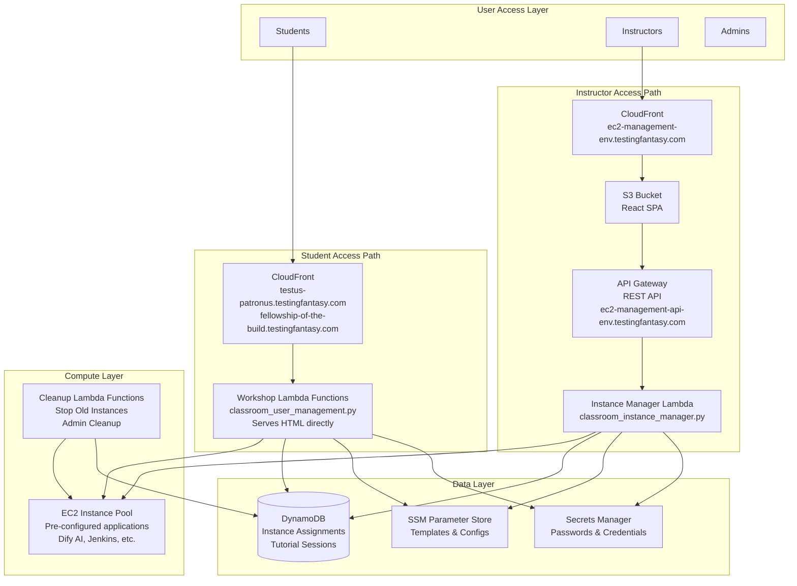

# Cloud Classroom Provisioning

[](https://Bassaganas.github.io/cloud-classroom-provisioning/)

A comprehensive Infrastructure as Code (IaC) solution for provisioning and managing cloud classroom environments on AWS and Azure. This project automates the creation of student accounts, EC2 instance pools with pre-configured applications (Dify AI, Jenkins), and provides a web-based management interface for instructors.

## 🎯 Project Goal

This project enables educational institutions and training organizations to:

- **Automate Classroom Setup**: Deploy complete cloud classroom infrastructure with a single command
- **Manage Student Accounts**: Automatically create and manage student AWS/Azure accounts with appropriate permissions
- **Provide Hands-On Learning**: Pre-configure EC2 instances with applications like Dify AI and Jenkins for immediate use
- **Control Costs**: Automatically stop/terminate idle instances to minimize cloud costs
- **Simplify Management**: Web-based UI for instructors to manage instances, assignments, and configurations
- **Support Multiple Workshops**: Deploy different workshop configurations (Testus Patronus, Fellowship, etc.) with isolated resources

## 🏗️ Architecture Overview

The system follows a **serverless modular architecture** pattern with **separate access paths for students and instructors**:



## 🚀 Quick Start

### For Teaching/Training (with EC2 instances)

```bash
./scripts/setup_classroom.sh \
  --name my-classroom \
  --cloud aws \
  --region eu-west-1 \
  --environment dev \
  --with-pool \
  --pool-size 10  # Number of machines you need, can be created later from ec2 manager
```

### For Development/Testing (Lambda only, no EC2 costs)

```bash
./scripts/setup_classroom.sh \
  --name dev-test \
  --cloud aws \
  --region eu-west-1 \
  --environment dev
```

## 📚 Documentation

Full documentation is available at: **[https://Bassaganas.github.io/cloud-classroom-provisioning/](https://Bassaganas.github.io/cloud-classroom-provisioning/)**

### Quick Links

- [Getting Started](https://Bassaganas.github.io/cloud-classroom-provisioning/docs/getting-started/quick-start) - Quick deployment guide
- [Architecture](https://Bassaganas.github.io/cloud-classroom-provisioning/docs/architecture/overview) - System architecture and components
- [Deployment Guide](https://Bassaganas.github.io/cloud-classroom-provisioning/docs/deployment/guide) - Step-by-step deployment instructions
- [Custom Domains](https://Bassaganas.github.io/cloud-classroom-provisioning/docs/deployment/custom-domains) - Custom domain configuration
- [Usage Guide](https://Bassaganas.github.io/cloud-classroom-provisioning/docs/usage/instructors) - For instructors and students
- [API Reference](https://Bassaganas.github.io/cloud-classroom-provisioning/docs/usage/api) - Instance Manager API documentation
- [Terraform Structure](https://Bassaganas.github.io/cloud-classroom-provisioning/docs/development/terraform) - Infrastructure as Code organization
- [Troubleshooting](https://Bassaganas.github.io/cloud-classroom-provisioning/docs/reference/troubleshooting) - Common issues and solutions
- [Cost Optimization](https://Bassaganas.github.io/cloud-classroom-provisioning/docs/reference/costs) - Cost estimates and saving tips

## 🏗️ Key Components

**Student-Facing Components:**
- Workshop Lambda Functions that serve HTML pages directly to students
- Accessed via CloudFront: `testus-patronus.testingfantasy.com`, `fellowship-of-the-build.testingfantasy.com`

**Instructor-Facing Components:**
- EC2 Manager Frontend (React SPA) hosted on S3 and served via CloudFront
- API Gateway REST API for instance management
- Instance Manager Lambda for EC2 lifecycle management

**Shared Components:**
- EC2 Instances with pre-configured applications (Dify AI, Jenkins)
- Data Storage: DynamoDB, SSM Parameter Store, Secrets Manager
- Infrastructure as Code: Terraform modules for reproducible deployments

## 🤝 Contributing

1. Fork the repository
2. Create a feature branch
3. Test your changes with a small classroom deployment
4. Update documentation if needed
5. Submit a pull request

For more details, see the [Contributing Guide](https://Bassaganas.github.io/cloud-classroom-provisioning/docs/contributing).

## 📄 License

This project is licensed under the MIT License - see the LICENSE file for details.

## 🆘 Support

For support:
1. Check the [documentation](https://Bassaganas.github.io/cloud-classroom-provisioning/)
2. Review existing GitHub issues
3. Test with a small deployment first
4. Open a detailed issue with logs and configuration
5. Contact the maintainers
