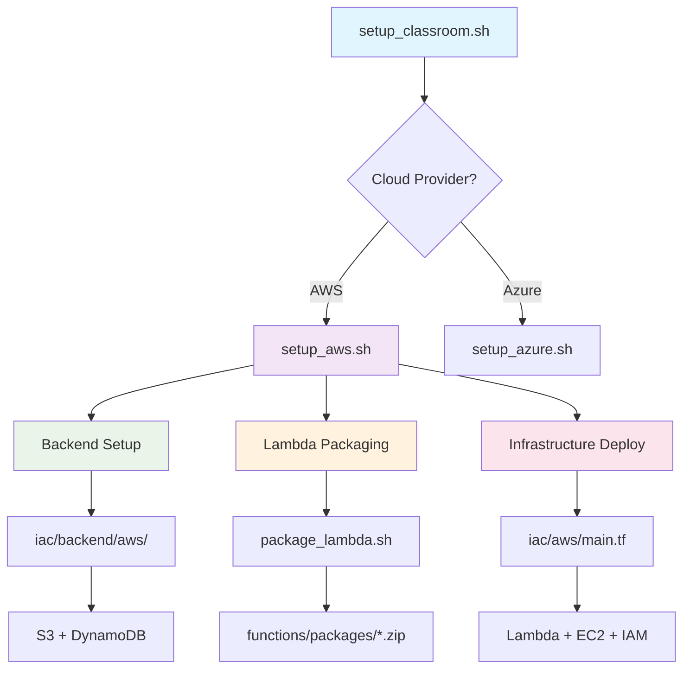
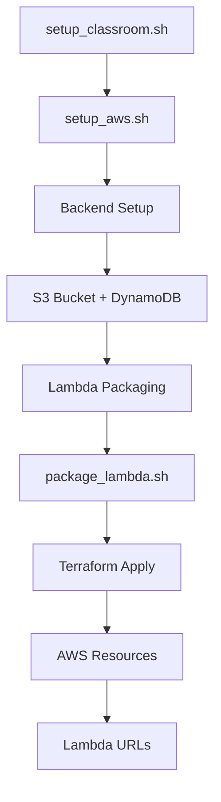

# Cloud Classroom Provisioning

This project provides infrastructure and automation for managing cloud classroom environments in both AWS and Azure. It creates Lambda functions for user management, optional EC2 instance pools with pre-configured Dify AI applications, and automated Terraform backend setup.

## 🎯 What This Project Does

- **🏗️ Automated Infrastructure**: Deploy complete cloud classrooms with a single command
- **👥 User Management**: Lambda functions to create and manage student accounts
- **🖥️ EC2 Instance Pools**: Pre-configured instances with Dify AI for hands-on learning
- **🔒 Secure Backend**: Automated Terraform state management with S3 and DynamoDB
- **🧹 Easy Cleanup**: Destroy resources while preserving backend for reuse

## Quick Start

### 🚀 Deploy a Complete AWS Classroom

```bash
# Deploy with EC2 instance pool (recommended for hands-on classes)
./scripts/setup_classroom.sh --name my-classroom --cloud aws --region eu-west-3 --with-pool --pool-size 10

# Deploy Lambda functions only (cost-effective for basic user management)
./scripts/setup_classroom.sh --name my-classroom --cloud aws --region eu-west-3
```

### 🗑️ Destroy Infrastructure

```bash
# Destroy classroom infrastructure (keeps Terraform backend for reuse)
./scripts/setup_classroom.sh --name my-classroom --cloud aws --region eu-west-3 --destroy
```

## Development Environment Setup

### Option 1: Using GitHub Codespaces (Recommended)

GitHub Codespaces provides a pre-configured development environment in the cloud.

1. Navigate to the repository on GitHub
2. Click the green "Code" button
3. Select "Create codespace on main"
4. Wait for the environment to be created

The Codespace includes:
- Python 3.9+
- AWS CLI
- Azure CLI
- Terraform
- Virtual environment management
- All required VS Code extensions

### Option 2: Using Dev Containers (Alternative)

This project includes a `.devcontainer` configuration that provides a consistent development environment.

1. Install prerequisites:
   - [Docker Desktop](https://www.docker.com/products/docker-desktop)
   - [Visual Studio Code](https://code.visualstudio.com/)
   - [Remote - Containers extension](https://marketplace.visualstudio.com/items?itemName=ms-vscode-remote.remote-containers)

2. Open the project in VS Code:
   ```bash
   code .
   ```

3. When prompted, click "Reopen in Container" or use the command palette (F1) and select "Remote-Containers: Reopen in Container"

The dev container includes:
- Python 3.9+
- AWS CLI
- Azure CLI
- Terraform
- Virtual environment management

### Option 3: Local Setup

#### 1. Install Python and Virtual Environment

**macOS (using Homebrew)**:
```bash
# Install Homebrew if not installed
/bin/bash -c "$(curl -fsSL https://raw.githubusercontent.com/Homebrew/install/HEAD/install.sh)"

# Install Python and Terraform
brew install python terraform

# Install virtualenv
pip3 install virtualenv
```

**Windows**:
```bash
# Install Python from https://www.python.org/downloads/
# During installation, check "Add Python to PATH"

# Install virtualenv
pip install virtualenv
```

#### 2. Install AWS CLI

**macOS**:
```bash
brew install awscli
```

**Windows**:
```bash
# Download and run the MSI installer from:
# https://awscli.amazonaws.com/AWSCLIV2.msi
```

#### 3. Install Azure CLI

**macOS**:
```bash
brew install azure-cli
```

**Windows**:
```bash
# Download and run the MSI installer from:
# https://aka.ms/installazurecliwindows
```

## Authentication Setup

### AWS Authentication

1. Configure AWS credentials:
   ```bash
   aws configure
   ```
   You'll need:
   - AWS Access Key ID
   - AWS Secret Access Key
   - Default region (e.g., eu-west-3)
   - Default output format (json)

2. Or use environment variables:
   ```bash
   export AWS_ACCESS_KEY_ID="your_access_key"
   export AWS_SECRET_ACCESS_KEY="your_secret_key"
   export AWS_DEFAULT_REGION="your_region"
   ```

### Azure Authentication

1. Login to Azure:
   ```bash
   az login
   ```
   This will open a browser window for authentication.

2. Set subscription:
   ```bash
   az account set --subscription "your-subscription-id"
   ```

## 📋 Complete Deployment Guide

### Step-by-Step AWS Deployment

#### 1. Prerequisites Setup

**Install Required Tools:**
```bash
# macOS (using Homebrew)
brew install terraform awscli

# Or follow the Development Environment Setup section below
```

**Configure AWS Credentials:**
```bash
# Option 1: Interactive configuration
aws configure

# Option 2: Environment variables
export AWS_ACCESS_KEY_ID="your_access_key"
export AWS_SECRET_ACCESS_KEY="your_secret_key"
export AWS_DEFAULT_REGION="eu-west-3"
```

**Verify Setup:**
```bash
# Test AWS access
aws sts get-caller-identity

# Test Terraform
terraform version
```

#### 2. Deploy Your Classroom

**🎓 For Teaching/Training (with EC2 instances):**
```bash
./scripts/setup_classroom.sh \
  --name production-class \
  --cloud aws \
  --region eu-west-3 \
  --with-pool \
  --pool-size 15
```

**💰 For Development/Testing (Lambda only):**
```bash
./scripts/setup_classroom.sh \
  --name dev-class \
  --cloud aws \
  --region eu-west-3
```

#### 3. What Gets Created

**Terraform Backend (Automatic):**
- 🪣 S3 Bucket: `terraform-state-{classroom}-{timestamp}`
- 🔒 DynamoDB Table: `terraform-locks-{classroom}`
- 🔐 Encryption and versioning enabled

**Main Infrastructure:**
- ⚡ Lambda Functions: User management, status checking, cleanup
- 🖥️ EC2 Instances: Pre-configured with Dify AI (if `--with-pool`)
- 👤 IAM Roles: Secure permissions for all services
- 📊 DynamoDB Tables: Instance assignments and tracking
- 🔧 SSM Parameters: Configuration storage

#### 4. Access Your Classroom

After deployment, you'll receive:
```bash
=== DEPLOYMENT SUCCESSFUL ===

User Management Lambda URL:
https://abc123.lambda-url.eu-west-3.on.aws/

Status Lambda URL:
https://def456.lambda-url.eu-west-3.on.aws/

EC2 Pool Information:
Pool Size: 15 instances
```

#### 5. Manage Students

**Create Student Accounts:**
1. Visit the User Management Lambda URL
2. Students get assigned EC2 instances automatically
3. They receive Dify AI access credentials
4. Monitor usage via Status Lambda URL

#### 6. Cleanup When Done

```bash
# Destroy classroom (keeps backend for reuse)
./scripts/setup_classroom.sh --name production-class --cloud aws --destroy

# Optional: Clean up users if needed
./scripts/cleanup_aws_users.sh
```

## 📋 Scripts Documentation

### Main Deployment Script

#### `setup_classroom.sh` - Master Deployment Script

This is the **main entry point** that orchestrates the entire deployment process.

**Usage:**
```bash
./scripts/setup_classroom.sh --name <classroom-name> --cloud [aws|azure] [OPTIONS]
```

**Required Parameters:**
- `--name`: Name of the classroom (used for resource naming)
- `--cloud`: Cloud provider (`aws` or `azure`)

**AWS Options:**
- `--region`: AWS region (default: `eu-west-1`)
- `--with-pool`: Create EC2 instance pool for students
- `--pool-size`: Number of EC2 instances (default: 40)

**Common Options:**
- `--destroy`: Destroy infrastructure instead of creating
- `--parallelism`: Terraform parallelism (default: 4)
- `--force-unlock`: Force unlock Terraform state

**Examples:**
```bash
# Full classroom with 20 EC2 instances
./scripts/setup_classroom.sh --name spring-2024 --cloud aws --region eu-west-3 --with-pool --pool-size 20

# Lambda-only deployment (no EC2 costs)
./scripts/setup_classroom.sh --name dev-test --cloud aws --region eu-west-3

# Destroy everything
./scripts/setup_classroom.sh --name spring-2024 --cloud aws --destroy
```

### AWS-Specific Scripts

#### `setup_aws.sh` - AWS Infrastructure Deployment

**⚠️ Note:** This script is called automatically by `setup_classroom.sh`. You typically don't need to run it directly.

Handles AWS-specific deployment including automated Terraform backend setup.

**Usage:**
```bash
./scripts/setup_aws.sh <classroom-name> <region> [create|destroy] [OPTIONS]
```

**What it does automatically:**

1. **🏗️ Backend Setup** (First Time):
   ```bash
   # Creates in iac/backend/aws/
   - S3 Bucket: terraform-state-{classroom}-{timestamp}
   - DynamoDB Table: terraform-locks-{classroom}
   - Encryption and versioning enabled
   ```

2. **📦 Lambda Packaging**:
   ```bash
   # Creates in functions/packages/
   - testus_patronus_user_management.zip
   - testus_patronus_status.zip  
   - testus_patronus_stop_old_instances.zip
   ```

3. **🔧 Backend Configuration**:
   ```bash
   # Auto-generates iac/aws/backend.tf
   terraform {
     backend "s3" {
       bucket         = "terraform-state-classroom-123456"
       key            = "classroom/my-class/terraform.tfstate"
       region         = "eu-west-3"
       dynamodb_table = "terraform-locks-my-class"
       encrypt        = true
     }
   }
   ```

4. **🚀 Infrastructure Deployment**:
   ```bash
   # Deploys all resources in iac/aws/
   terraform init
   terraform apply -auto-approve
   ```

**Options:**
- `--with-pool`: Include EC2 instance pool
- `--pool-size <number>`: Number of EC2 instances (default: 4)
- `--skip-packaging`: Skip Lambda function packaging (use existing packages)

**Direct Usage Examples:**
```bash
# Full deployment with 15 instances
./scripts/setup_aws.sh my-class eu-west-3 create --with-pool --pool-size 15

# Lambda-only deployment
./scripts/setup_aws.sh my-class eu-west-3 create

# Destroy infrastructure (preserves backend for reuse)
./scripts/setup_aws.sh my-class eu-west-3 destroy

# Skip packaging (faster if packages already exist)
./scripts/setup_aws.sh my-class eu-west-3 create --skip-packaging
```

#### `package_lambda.sh` - Lambda Function Packaging

**⚠️ Note:** This script is called automatically by `setup_aws.sh`. You rarely need to run it directly.

Packages Python Lambda functions with their dependencies into deployment-ready ZIP files.

**Usage:**
```bash
./scripts/package_lambda.sh --cloud aws
```

**What it does:**
1. **Creates Virtual Environment**: Isolates Python dependencies
2. **Installs Dependencies**: From `functions/aws/requirements.txt`
3. **Packages Functions**: Creates ZIP files with code + dependencies
4. **Validates Packages**: Ensures all dependencies are included

**Output Files:**
```bash
functions/packages/
├── testus_patronus_user_management.zip    # Student account creation
├── testus_patronus_status.zip             # Instance status checking  
└── testus_patronus_stop_old_instances.zip # Cleanup automation
```

**When to run manually:**
- Testing Lambda function changes
- Debugging packaging issues
- Creating packages before `--skip-packaging` deployment

## 🔄 Script Workflow & Dependencies

### How Scripts Work Together



### Script Execution Order

**1. Entry Point: `setup_classroom.sh`**
```bash
# User runs this command
./scripts/setup_classroom.sh --name my-class --cloud aws --region eu-west-3 --with-pool
```

**2. AWS Handler: `setup_aws.sh`**
```bash
# Called automatically with parameters
./scripts/setup_aws.sh my-class eu-west-3 create --with-pool --pool-size 40
```

**3. Backend Setup (Automatic)**
```bash
cd iac/backend/aws
terraform init && terraform apply -auto-approve
# Creates: S3 bucket + DynamoDB table
```

**4. Lambda Packaging (Automatic)**
```bash
./scripts/package_lambda.sh --cloud aws
# Creates: functions/packages/*.zip files
```

**5. Main Infrastructure (Automatic)**
```bash
cd iac/aws
terraform init && terraform apply -auto-approve
# Creates: Lambda functions, EC2 instances, IAM roles
```

### File Dependencies

**Configuration Files Created:**
```bash
iac/backend/aws/terraform.tfvars     # Backend configuration
iac/aws/backend.tf                   # Points to backend resources
iac/aws/terraform.tfvars             # Main infrastructure config
functions/packages/*.zip             # Lambda deployment packages
```

**Key Directories:**
```bash
scripts/                    # All automation scripts
├── setup_classroom.sh     # Main entry point
├── setup_aws.sh          # AWS-specific deployment
├── package_lambda.sh     # Lambda packaging
└── cleanup_*.sh          # Cleanup utilities

iac/                       # Infrastructure as Code
├── backend/aws/          # Terraform backend (S3 + DynamoDB)
└── aws/                  # Main AWS resources

functions/                 # Lambda function code
├── aws/                  # Python source code
└── packages/             # Compiled ZIP packages (auto-generated)
```

### Cleanup Scripts

#### `cleanup_aws_users.sh` - AWS User Cleanup

Removes all conference users and their resources.

**Usage:**
```bash
./scripts/cleanup_aws_users.sh [--dry-run]
```

#### `delete_students.sh` - Student Resource Cleanup

Removes specific student resources.

**Usage:**
```bash
./scripts/delete_students.sh <student-id>
```

## 🏗️ Infrastructure Architecture

### AWS Infrastructure Components

#### Terraform Backend (`iac/backend/aws/`)
- **S3 Bucket**: Stores Terraform state files with versioning and encryption
- **DynamoDB Table**: Provides state locking mechanism
- **KMS Key**: Encrypts state files

#### Main Infrastructure (`iac/aws/`)
- **Lambda Functions**: User management, status checking, instance cleanup
- **IAM Roles & Policies**: Secure permissions for Lambda functions
- **EC2 Instance Pool** (optional): Pre-configured instances with Dify
- **DynamoDB Tables**: Instance assignments and user tracking
- **SSM Parameters**: Configuration storage
- **Security Groups**: Network access control

### Deployment Flow



## 🚀 Complete AWS Deployment Walkthrough

### Real-World Example: Setting Up "AI Workshop 2024"

Let's walk through deploying a complete classroom for an AI workshop with 20 students.

#### Step 1: Prepare Your Environment

```bash
# Clone the repository
git clone https://github.com/your-org/cloud-classroom-provisioning.git
cd cloud-classroom-provisioning

# Verify AWS credentials
aws sts get-caller-identity
# Should return your AWS account details

# Verify Terraform
terraform version
# Should show Terraform v1.0+
```

#### Step 2: Deploy the Classroom

```bash
# Deploy complete classroom with EC2 instances for hands-on learning
./scripts/setup_classroom.sh \
  --name ai-workshop-2024 \
  --cloud aws \
  --region eu-west-3 \
  --with-pool \
  --pool-size 20
```

**What happens during deployment:**
```bash
Setting up Terraform backend...
Backend created successfully:
  S3 Bucket: terraform-state-ai-workshop-2024-1698765432
  DynamoDB Table: terraform-locks-ai-workshop-2024

Packaging Lambda function...
✓ testus_patronus_user_management.zip created
✓ testus_patronus_status.zip created  
✓ testus_patronus_stop_old_instances.zip created

Configuring main Terraform with remote backend...
terraform init
terraform apply -auto-approve

=== DEPLOYMENT SUCCESSFUL ===

User Management Lambda URL:
https://abc123def456.lambda-url.eu-west-3.on.aws/

Status Lambda URL:
https://ghi789jkl012.lambda-url.eu-west-3.on.aws/

EC2 Pool Information:
Pool Size: 20 instances
[
  "i-0123456789abcdef0",
  "i-0fedcba9876543210",
  ...
]
```

#### Step 3: Access Your Classroom Management

**Student Registration:**
1. Share the **User Management Lambda URL** with students
2. Each student visits the URL and gets:
   - Assigned EC2 instance
   - Dify AI access credentials  
   - Instance connection details

**Monitor Your Classroom:**
1. Use the **Status Lambda URL** to check:
   - Which instances are assigned
   - Student activity status
   - Resource utilization

#### Step 4: During the Workshop

**For Students:**
- Each gets a dedicated EC2 instance with Dify AI pre-installed
- Access via web browser (no SSH needed)
- Pre-configured environment ready for AI experiments

**For Instructors:**
- Monitor all instances from Status URL
- See real-time assignments
- Track usage patterns

#### Step 5: After the Workshop

```bash
# Destroy the classroom (keeps backend for future workshops)
./scripts/setup_classroom.sh \
  --name ai-workshop-2024 \
  --cloud aws \
  --destroy

# Optional: Clean up any remaining user resources
./scripts/cleanup_aws_users.sh
```

### Alternative: Development/Testing Deployment

For testing or development (no EC2 costs):

```bash
# Deploy Lambda functions only
./scripts/setup_classroom.sh \
  --name dev-test \
  --cloud aws \
  --region eu-west-3

# Test the user management system
# Students won't get EC2 instances, but user management works
```

## 🔧 Terraform Backend Architecture

### How the Backend Works

The project uses a **two-tier Terraform setup** for better state management:

```
📁 iac/
├── 📁 backend/aws/          # Tier 1: Backend Infrastructure
│   ├── main.tf              # S3 bucket + DynamoDB table
│   ├── variables.tf         # Backend configuration
│   └── outputs.tf           # Bucket/table names
└── 📁 aws/                  # Tier 2: Main Infrastructure  
    ├── main.tf              # Lambda, EC2, IAM resources
    ├── backend.tf           # Points to Tier 1 backend
    └── variables.tf         # Main configuration
```

### Automatic Backend Setup

The `setup_aws.sh` script handles everything automatically:

**Step 1: Create Backend Resources**
```bash
cd iac/backend/aws
# Creates terraform.tfvars with unique names
terraform init
terraform apply -auto-approve
# Result: S3 bucket + DynamoDB table created
```

**Step 2: Configure Main Infrastructure**
```bash
cd iac/aws
# Auto-generates backend.tf pointing to Step 1 resources
terraform {
  backend "s3" {
    bucket         = "terraform-state-classroom-123456"
    key            = "classroom/my-class/terraform.tfstate"
    region         = "eu-west-3"
    dynamodb_table = "terraform-locks-my-class"
    encrypt        = true
  }
}
```

**Step 3: Deploy Main Infrastructure**
```bash
terraform init    # Connects to remote backend
terraform apply   # Creates Lambda, EC2, IAM resources
```

### Backend Benefits

- **🔒 State Locking**: Prevents concurrent modifications
- **🔐 Encryption**: State files encrypted in S3
- **📚 Versioning**: Full history of infrastructure changes
- **👥 Team Sharing**: Multiple users can work on same infrastructure
- **🔄 Reusability**: Backend persists across classroom deployments

### Manual Backend Setup (Advanced Users)

If you need custom backend configuration:

```bash
# Navigate to backend directory
cd iac/backend/aws

# Create custom configuration
cat > terraform.tfvars << EOF
aws_region         = "eu-west-3"
state_bucket_name  = "my-custom-terraform-state"
dynamodb_table_name = "my-custom-terraform-locks"
EOF

# Deploy backend
terraform init
terraform apply

# Get outputs for main configuration
BUCKET_NAME=$(terraform output -raw state_bucket_name)
DYNAMODB_TABLE=$(terraform output -raw dynamodb_table_name)
echo "Use these in your main backend.tf:"
echo "  bucket = \"$BUCKET_NAME\""
echo "  dynamodb_table = \"$DYNAMODB_TABLE\""
```

### Backend Cleanup

**When destroying classrooms:**
```bash
# This destroys main infrastructure but KEEPS backend
./scripts/setup_aws.sh my-class eu-west-3 destroy
```

**To destroy backend (advanced):**
```bash
# Only do this if you're sure you don't need the state history
cd iac/backend/aws
terraform destroy
```

## 📁 Project Structure

```
.
├── iac/                           # Infrastructure as Code
│   ├── aws/                      # AWS infrastructure
│   │   ├── main.tf              # Main AWS resources
│   │   ├── variables.tf         # Input variables
│   │   ├── outputs.tf           # Output values
│   │   ├── user_data.sh         # EC2 initialization script
│   │   └── iam/                 # IAM policies and roles
│   ├── backend/                 # Terraform backend setup
│   │   ├── aws/                 # AWS backend (S3 + DynamoDB)
│   │   └── azure/               # Azure backend (Storage Account)
│   └── azure/                   # Azure infrastructure
├── functions/                    # Cloud functions
│   ├── aws/                     # AWS Lambda functions
│   │   ├── testus_patronus_user_management.py
│   │   ├── testus_patronus_status.py
│   │   └── testus_patronus_stop_old_instances.py
│   ├── azure/                   # Azure Functions
│   └── packages/                # Packaged functions (auto-generated)
├── scripts/                     # Deployment and utility scripts
│   ├── setup_classroom.sh      # Main deployment script
│   ├── setup_aws.sh            # AWS-specific deployment
│   ├── package_lambda.sh       # Lambda function packaging
│   ├── cleanup_aws_users.sh    # User cleanup
│   └── delete_students.sh      # Student resource cleanup
└── README.md                    # This file
```

## 🛡️ Security Considerations

1. **Access Control**:
   - IAM roles follow principle of least privilege
   - Lambda functions have minimal required permissions
   - EC2 instances use instance profiles

2. **State Management**:
   - Terraform state encrypted in S3
   - State locking prevents concurrent modifications
   - Backend resources isolated per classroom

3. **Network Security**:
   - Security groups restrict access to necessary ports
   - EC2 instances in default VPC with minimal exposure
   - Lambda functions in VPC when needed

4. **Credential Management**:
   - No hardcoded credentials in code
   - SSM Parameter Store for configuration
   - Temporary credentials for student access

## 🔍 Troubleshooting

### Common Issues

1. **Terraform State Locked**:
   ```bash
   ./scripts/setup_classroom.sh --name my-class --cloud aws --force-unlock
   ```

2. **Lambda Packaging Fails**:
   ```bash
   # Install missing dependencies
   pip install virtualenv
   ./scripts/package_lambda.sh --cloud aws
   ```

3. **AWS Credentials Not Found**:
   ```bash
   aws configure
   # or
   export AWS_ACCESS_KEY_ID="your_key"
   export AWS_SECRET_ACCESS_KEY="your_secret"
   ```

4. **Backend Already Exists**:
   - The script handles existing backends gracefully
   - Use `--destroy` to clean up if needed

### Debug Mode

Enable verbose output:
```bash
export TF_LOG=DEBUG
./scripts/setup_classroom.sh --name debug-class --cloud aws
```

## 📊 Cost Optimization

### AWS Costs

**With EC2 Pool (25 instances)**:
- EC2 instances: ~$50-100/month
- Lambda functions: ~$1-5/month
- Storage (S3, DynamoDB): ~$1-3/month

**Lambda-Only Deployment**:
- Lambda functions: ~$1-5/month
- Storage: ~$1-3/month

### Cost-Saving Tips

1. **Use smaller instance pool**: Start with 10-15 instances
2. **Destroy when not in use**: Use `--destroy` between classes
3. **Monitor usage**: Check AWS Cost Explorer regularly
4. **Right-size instances**: Default t3.medium is usually sufficient

## 🤝 Contributing

1. Fork the repository
2. Create a feature branch
3. Test your changes with a small classroom deployment
4. Update documentation if needed
5. Submit a pull request

## 📄 License

This project is licensed under the MIT License - see the LICENSE file for details.

## 🆘 Support

For support:
1. Check this documentation
2. Review existing GitHub issues
3. Test with a small deployment first
4. Open a detailed issue with logs and configuration
5. Contact the maintainers

---

## 📚 Additional Resources

- [AWS Lambda Documentation](https://docs.aws.amazon.com/lambda/)
- [Terraform AWS Provider](https://registry.terraform.io/providers/hashicorp/aws/latest/docs)
- [Dify Documentation](https://docs.dify.ai/)
- [AWS IAM Best Practices](https://docs.aws.amazon.com/IAM/latest/UserGuide/best-practices.html) 