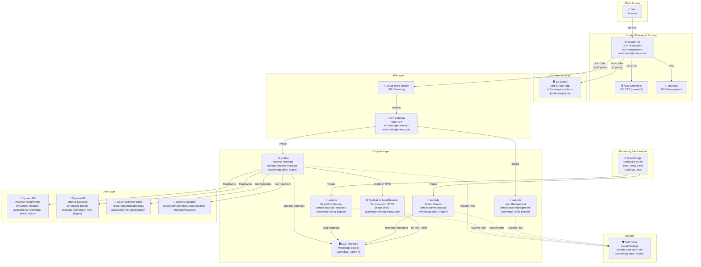
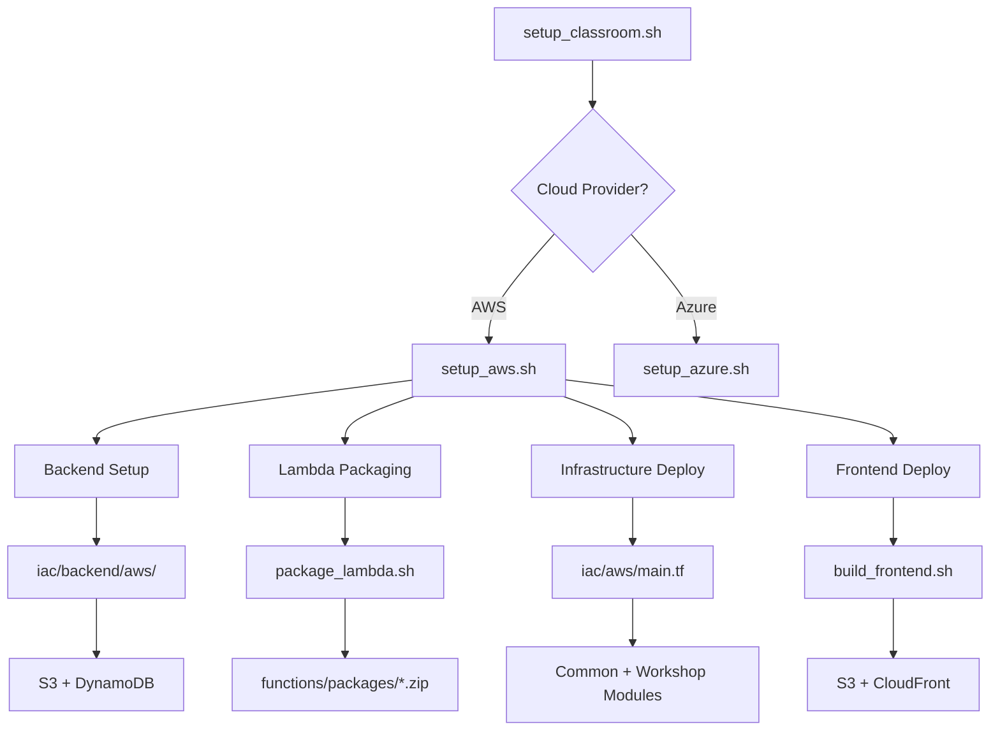

# Cloud Classroom Provisioning

A comprehensive Infrastructure as Code (IaC) solution for provisioning and managing cloud classroom environments on AWS and Azure. This project automates the creation of student accounts, EC2 instance pools with pre-configured applications (Dify AI, Jenkins), and provides a web-based management interface for instructors.

## 🎯 Project Goal

This project enables educational institutions and training organizations to:

- **Automate Classroom Setup**: Deploy complete cloud classroom infrastructure with a single command
- **Manage Student Accounts**: Automatically create and manage student AWS/Azure accounts with appropriate permissions
- **Provide Hands-On Learning**: Pre-configure EC2 instances with applications like Dify AI and Jenkins for immediate use
- **Control Costs**: Automatically stop/terminate idle instances to minimize cloud costs
- **Simplify Management**: Web-based UI for instructors to manage instances, assignments, and configurations
- **Support Multiple Workshops**: Deploy different workshop configurations (Testus Patronus, Fellowship, etc.) with isolated resources

## 🏗️ Overall Architecture

The system follows a **serverless, modular monolith** architecture pattern:

```
┌─────────────────────────────────────────────────────────────┐
│                    User Access Layer                         │
│  ┌──────────────┐  ┌──────────────┐  ┌──────────────┐      │
│  │   Students   │  │  Instructors │  │   Admins     │      │
│  └──────┬───────┘  └──────┬───────┘  └──────┬───────┘      │
└─────────┼──────────────────┼──────────────────┼──────────────┘
          │                  │                  │
          ▼                  ▼                  ▼
┌─────────────────────────────────────────────────────────────┐
│                    Frontend Layer                          │
│  ┌──────────────────────────────────────────────────────┐   │
│  │  React SPA (CloudFront + S3)                        │   │
│  │  - Instance Management UI                            │   │
│  │  - Workshop Configuration                           │   │
│  │  - Tutorial Session Management                      │   │
│  └──────────────────────────────────────────────────────┘   │
└─────────────────────────────────────────────────────────────┘
          │
          ▼
┌─────────────────────────────────────────────────────────────┐
│                    API Layer                                  │
│  ┌──────────────────────────────────────────────────────┐   │
│  │  API Gateway (REST API)                              │   │
│  │  - Routes /api/* requests                            │   │
│  │  - Custom domain: ec2-management-api.testingfantasy │   │
│  └──────────────────────────────────────────────────────┘   │
└─────────────────────────────────────────────────────────────┘
          │
          ▼
┌─────────────────────────────────────────────────────────────┐
│                    Compute Layer                              │
│  ┌──────────────┐  ┌──────────────┐  ┌──────────────┐      │
│  │   Lambda    │  │   Lambda     │  │   Lambda     │      │
│  │  Instance   │  │   User       │  │   Cleanup    │      │
│  │  Manager    │  │  Management  │  │   Functions  │      │
│  └──────┬──────┘  └──────┬───────┘  └──────┬───────┘      │
│         │                │                 │               │
│         └────────────────┼─────────────────┘               │
│                          │                                 │
│         ┌────────────────▼─────────────────┐              │
│         │      EC2 Instance Pool            │              │
│         │  - Pre-configured applications     │              │
│         │  - Dify AI, Jenkins, etc.          │              │
│         └────────────────────────────────────┘              │
└─────────────────────────────────────────────────────────────┘
          │
          ▼
┌─────────────────────────────────────────────────────────────┐
│                    Data Layer                                │
│  ┌──────────────┐  ┌──────────────┐  ┌──────────────┐      │
│  │  DynamoDB    │  │  SSM         │  │  Secrets     │      │
│  │  - Instance  │  │  Parameter   │  │  Manager     │      │
│  │    Assignments│  │  Store       │  │  - Passwords │      │
│  │  - Sessions  │  │  - Templates  │  │  - Configs   │      │
│  └──────────────┘  └──────────────┘  └──────────────┘      │
└─────────────────────────────────────────────────────────────┘
```

### Key Components

1. **Frontend (React SPA)**: Web-based management interface hosted on S3 and served via CloudFront
2. **API Gateway**: RESTful API that routes requests to Lambda functions
3. **Lambda Functions**: Serverless compute for business logic
4. **EC2 Instances**: Pre-configured compute resources for students
5. **Data Storage**: DynamoDB for state, SSM for configuration, Secrets Manager for credentials
6. **Infrastructure as Code**: Terraform modules for reproducible deployments

## 🏛️ AWS Architecture

### Detailed Component Architecture



### Resource Naming Convention

All AWS resources follow a consistent naming pattern:

```
{aws-service-name}-{resource-type}-{workshop-name}-{environment}-{region-code}
```

**Examples:**
- Lambda Function: `lambda-instance-manager-testus-patronus-dev-euwest1`
- DynamoDB Table: `dynamodb-instance-assignments-testus-patronus-dev-euwest1`
- S3 Bucket: `s3-ec2-manager-frontend-testus-patronus-dev-euwest1`
- IAM Role: `iam-lambda-execution-role-testus-patronus-dev-euwest1`

**Naming Components:**
- `{aws-service-name}`: AWS service identifier (lambda, dynamodb, s3, iam, etc.)
- `{resource-type}`: Specific resource type (instance-manager, instance-assignments, etc.)
- `{workshop-name}`: Workshop identifier (testus-patronus, fellowship, common)
- `{environment}`: Environment name (dev, staging, prod)
- `{region-code}`: Region code without hyphens (euwest1, uswest2, etc.)

### Component Details

#### Frontend & CDN Layer
- **Amazon CloudFront**: Global CDN serving the React SPA and routing API requests
  - Custom domain: `ec2-management-{environment}.testingfantasy.com`
  - SSL/TLS termination via ACM certificates
- **Amazon S3**: Static website hosting for React application files
  - Bucket: `s3-ec2-manager-frontend-{workshop}-{env}-{region}`
  - Versioning and encryption enabled
- **AWS Certificate Manager (ACM)**: SSL/TLS certificates (must be in `us-east-1` for CloudFront)
- **Amazon Route53**: DNS management for custom domains

#### API Layer
- **Amazon API Gateway**: REST API endpoint routing `/api/*` requests
  - Custom domain: `ec2-management-api-{environment}.testingfantasy.com`
  - Regional endpoint type
  - CORS enabled for frontend access
- **CloudFront Function**: URL rewriting for API path routing

#### Compute Layer
- **Instance Manager Lambda**: Core Lambda function handling EC2 lifecycle
  - Function name: `lambda-instance-manager-{workshop}-{env}-{region}`
  - Supports both API Gateway and Function URL invocation
  - Manages instance creation, assignment, deletion, HTTPS setup
- **Stop Old Instances Lambda**: Scheduled function stopping idle instances
  - Function name: `lambda-stop-old-instances-{workshop}-{env}-{region}`
  - Runs every 5 minutes via EventBridge
- **Admin Cleanup Lambda**: Scheduled function terminating admin instances
  - Function name: `lambda-admin-cleanup-{workshop}-{env}-{region}`
  - Runs on configurable schedule (default: weekly)
- **User Management Lambda**: Creates and manages student accounts
  - Function name: `lambda-user-management-{workshop}-{env}-{region}`
  - Workshop-specific (Testus Patronus, Fellowship)
- **Amazon EC2 Instances**: Pre-configured instances for students
  - Pool instances: `{workshop}-pool-{i}`
  - Admin instances: `{workshop}-admin-{i}`
  - Pre-installed applications: Dify AI, Jenkins, etc.
- **Application Load Balancer (ALB)**: On-demand HTTPS endpoints
  - Creates subdomains: `{instance-id}.{workshop}.testingfantasy.com`
  - Wildcard certificate for `*.testingfantasy.com`

#### Data Layer
- **DynamoDB - Instance Assignments**: Tracks EC2 instance assignments
  - Table: `dynamodb-instance-assignments-{workshop}-{env}-{region}`
  - Hash key: `instance_id`
  - GSI: `student_name`
- **DynamoDB - Tutorial Sessions**: Tracks tutorial session metadata
  - Table: `dynamodb-tutorial-sessions-{workshop}-{env}-{region}`
  - Hash key: `session_id`
  - GSI: `workshop_name`
- **AWS Systems Manager Parameter Store**: Configuration storage
  - `/classroom/templates/{env}`: Workshop template configurations (AMI, instance type, user_data)
  - `/classroom/{workshop}/{env}/*`: Workshop-specific timeout settings
- **AWS Secrets Manager**: Secure credential storage
  - `classroom/{workshop}/{env}/instance-manager/password`: Instance manager authentication password

#### Monitoring & Automation
- **Amazon EventBridge**: Scheduled rules triggering cleanup functions
  - Stop old instances: Every 5 minutes
  - Admin cleanup: Configurable (default: weekly on Sunday 2 AM)

#### Security
- **IAM Roles**: Lambda execution roles with least-privilege permissions
  - Role name: `iam-lambda-execution-role-{workshop}-{env}-{region}`
  - Permissions: EC2, DynamoDB, SSM, Secrets Manager, ALB management
  - Instance profiles for EC2 instances

## 🚀 Deployment Guide

### Prerequisites

1. **Install Required Tools:**
   ```bash
   # macOS
   brew install terraform awscli python3
   
   # Linux
   sudo apt-get update
   sudo apt-get install terraform awscli python3 python3-pip
   ```

2. **Configure AWS Credentials:**
   ```bash
   aws configure
   # Enter your AWS Access Key ID, Secret Access Key, and default region
   
   # Verify access
   aws sts get-caller-identity
   ```

3. **Verify Terraform:**
   ```bash
   terraform version  # Should be >= 1.0.0
   ```

### Quick Start: Deploy a Complete Classroom

**For Teaching/Training (with EC2 instances):**
```bash
./scripts/setup_classroom.sh \
  --name my-classroom \
  --cloud aws \
  --region eu-west-1 \
  --environment dev \
  --with-pool \
  --pool-size 10
```

**For Development/Testing (Lambda only, no EC2 costs):**
```bash
./scripts/setup_classroom.sh \
  --name dev-test \
  --cloud aws \
  --region eu-west-1 \
  --environment dev
```

### Step-by-Step Deployment Process

The `setup_classroom.sh` script automates the entire deployment process:

1. **Backend Setup** (Automatic):
   - Creates S3 bucket for Terraform state: `terraform-state-classroom-shared-{region}`
   - Creates DynamoDB table for state locking: `terraform-locks-classroom-shared`
   - Enables encryption and versioning

2. **Lambda Packaging** (Automatic):
   - Packages Python Lambda functions with dependencies
   - Creates ZIP files in `functions/packages/`

3. **Infrastructure Deployment** (Automatic):
   - Deploys common infrastructure (EC2 manager, API Gateway, CloudFront)
   - Deploys workshop-specific infrastructure (user management, status functions)
   - Creates EC2 instance pool (if `--with-pool` specified)

4. **Frontend Deployment** (Automatic):
   - Builds React application
   - Uploads to S3 bucket
   - Invalidates CloudFront cache

### Deployment Options

**Environment Selection:**
```bash
# Deploy to dev environment (default)
./scripts/setup_classroom.sh --name my-class --cloud aws --environment dev

# Deploy to staging environment
./scripts/setup_classroom.sh --name my-class --cloud aws --environment staging

# Deploy to production environment
./scripts/setup_classroom.sh --name my-class --cloud aws --environment prod
```

**Partial Deployments:**
```bash
# Deploy only common infrastructure (EC2 manager)
./scripts/setup_classroom.sh --name my-class --cloud aws --only-common

# Deploy only workshop infrastructure
./scripts/setup_classroom.sh --name my-class --cloud aws --only-workshop
```

**Workshop Selection:**
```bash
# Deploy Testus Patronus workshop (default)
./scripts/setup_classroom.sh --name my-class --cloud aws --workshop testus_patronus

# Deploy Fellowship workshop
./scripts/setup_classroom.sh --name my-class --cloud aws --workshop fellowship
```

### Post-Deployment: Setting Up Custom Domain

After deployment, you'll need to configure DNS for the custom domain:

1. **Get ACM Certificate Validation Records:**
   ```bash
   cd iac/aws
   terraform output instance_manager_acm_certificate_validation_records
   ```

2. **Add DNS Validation Record:**
   - Add the CNAME record to your DNS provider (Route53/GoDaddy)
   - Wait for certificate validation (5-40 minutes)

3. **Complete Deployment:**
   ```bash
   cd iac/aws
   terraform apply  # Completes certificate validation
   ```

4. **Get CloudFront Domain:**
   ```bash
   terraform output instance_manager_cloudfront_domain
   ```

5. **Add Final CNAME Record:**
   - Name: `ec2-management-{environment}`
   - Value: `<cloudfront-domain-from-step-4>`

6. **Access Your Instance Manager:**
   - URL: `https://ec2-management-{environment}.testingfantasy.com`
   - Wait 5-15 minutes for DNS propagation

### Destroying Infrastructure

```bash
# Destroy classroom infrastructure (keeps backend for reuse)
./scripts/setup_classroom.sh \
  --name my-classroom \
  --cloud aws \
  --region eu-west-1 \
  --environment dev \
  --destroy
```

## 📖 Usage Guide

### For Instructors: Managing Classrooms

1. **Access the Instance Manager:**
   - Navigate to: `https://ec2-management-{environment}.testingfantasy.com`
   - Login with the password from AWS Secrets Manager

2. **Create Tutorial Sessions:**
   - Click "Create Tutorial Session"
   - Configure pool size, admin count, cleanup days
   - Session manages instance lifecycle automatically

3. **Manage EC2 Instances:**
   - View all instances (pool, admin, assigned)
   - Create new instances on-demand
   - Assign instances to students
   - Enable HTTPS for individual instances
   - Delete instances when no longer needed

4. **Configure Timeout Settings:**
   - Set stop timeout (default: 4 minutes)
   - Set terminate timeout (default: 20 minutes)
   - Set hard terminate timeout (default: 45 minutes)

### For Students: Accessing Resources

1. **Get User Account:**
   - Visit the User Management Lambda URL (provided by instructor)
   - Get assigned EC2 instance details
   - Receive Dify AI or Jenkins access credentials

2. **Access EC2 Instance:**
   - Via HTTPS (if enabled): `https://{instance-id}.{workshop}.testingfantasy.com`
   - Via SSH (if configured): Use provided credentials

### API Usage

The Instance Manager API can be accessed directly:

**Base URLs:**
- API Gateway: `https://ec2-management-api-{environment}.testingfantasy.com/api`
- Lambda Function URL: `https://{function-id}.lambda-url.{region}.on.aws/api`

**Authentication:**
All endpoints (except `/api/health` and `/api/login`) require password authentication.

**Example: List Instances**
```bash
curl -X GET "https://ec2-management-api-dev.testingfantasy.com/api/list?password=YOUR_PASSWORD"
```

**Example: Create Instance**
```bash
curl -X POST "https://ec2-management-api-dev.testingfantasy.com/api/create" \
  -H "Content-Type: application/json" \
  -d '{
    "password": "YOUR_PASSWORD",
    "workshop_name": "testus_patronus",
    "instance_type": "t3.small",
    "count": 1
  }'
```

## 🏗️ Terraform Structure

### Directory Organization

```
iac/
├── aws/                          # AWS Infrastructure (Root Module)
│   ├── main.tf                   # Root module (includes common + workshops)
│   ├── backend.tf                # Terraform backend configuration
│   ├── variables.tf              # Root variables
│   ├── outputs.tf                # Aggregate outputs
│   ├── terraform.tfvars          # Configuration values
│   ├── modules/                  # Reusable Terraform modules
│   │   ├── common/               # Common infrastructure module
│   │   │   ├── main.tf           # Module definition
│   │   │   ├── variables.tf      # Module inputs
│   │   │   ├── outputs.tf        # Module outputs
│   │   │   └── ...               # Other module files
│   │   ├── workshop/             # Parameterized workshop module
│   │   ├── compute/              # EC2 and security groups
│   │   ├── storage/              # DynamoDB, SSM, Secrets Manager
│   │   ├── lambda/               # Lambda functions
│   │   ├── api-gateway/          # API Gateway configuration
│   │   ├── cloudfront/           # CloudFront distributions
│   │   ├── s3/                   # S3 buckets
│   │   ├── iam/                  # IAM roles and policies
│   │   ├── iam-lambda/           # Lambda execution roles
│   │   └── monitoring/           # EventBridge rules
│   └── workshops/                # Workshop-specific files
│       ├── fellowship/
│       │   └── user_data.sh      # EC2 user data script
│       └── testus_patronus/
│           └── user_data.sh      # EC2 user data script
├── backend/                      # Terraform Backend Setup
│   ├── aws/                      # AWS backend (S3 + DynamoDB)
│   │   ├── main.tf               # Backend resources
│   │   ├── variables.tf          # Backend configuration
│   │   └── terraform.tfvars.example
│   └── azure/                    # Azure backend
└── azure/                        # Azure Infrastructure
```

### Root Module Structure

The `iac/aws/main.tf` file orchestrates all infrastructure:

```hcl
# Common Infrastructure Module
module "common" {
  source = "./modules/common"
  # ... common infrastructure variables
}

# Fellowship Workshop Module
module "workshop_fellowship" {
  source = "./modules/workshop"
  depends_on = [module.common]
  # ... fellowship-specific variables
}

# Testus Patronus Workshop Module
module "workshop_testus_patronus" {
  source = "./modules/workshop"
  depends_on = [module.common]
  # ... testus_patronus-specific variables
}
```

### Module Organization

**Common Module** (`modules/common/`):
- EC2 Instance Manager (Lambda, API Gateway, CloudFront)
- Shared S3 bucket for frontend
- Common security groups and IAM roles
- Shared DynamoDB tables and SSM parameters

**Workshop Module** (`modules/workshop/`):
- User Management Lambda function
- Status checking Lambda function
- Workshop-specific CloudFront distributions
- Workshop-specific DynamoDB tables
- Workshop-specific SSM parameters

**Reusable Modules**:
- `compute/`: EC2 instances, security groups, instance profiles
- `storage/`: DynamoDB tables, SSM parameters, Secrets Manager
- `lambda/`: Lambda function definitions
- `api-gateway/`: API Gateway REST API configuration
- `cloudfront/`: CloudFront distributions and functions
- `s3/`: S3 bucket configuration
- `iam/`: IAM roles and policies
- `monitoring/`: EventBridge scheduled rules

### Backend Configuration

Terraform state is stored remotely in S3:

```hcl
terraform {
  backend "s3" {
    bucket         = "terraform-state-classroom-shared-{region}"
    key            = "classroom/{environment}/terraform.tfstate"
    region         = "eu-west-1"
    dynamodb_table = "terraform-locks-classroom-shared"
    encrypt        = true
  }
}
```

**State Management:**
- Separate state files per environment: `classroom/dev/terraform.tfstate`, `classroom/staging/terraform.tfstate`
- State locking via DynamoDB prevents concurrent modifications
- Versioning enabled for state file history

### Variable Configuration

**Root Variables** (`iac/aws/variables.tf`):
- Environment configuration (dev, staging, prod)
- Region and domain settings
- Workshop-specific configurations
- EC2 instance types and pool sizes
- Timeout settings

**Configuration File** (`iac/aws/terraform.tfvars`):
```hcl
environment = "dev"
owner       = "admin"
region      = "eu-west-1"
```

### Outputs

**Root Outputs** (`iac/aws/outputs.tf`):
- Instance Manager URLs (Lambda, API Gateway, CloudFront)
- Workshop-specific Lambda URLs
- S3 bucket names
- Security group IDs
- Template configurations

**Access Outputs:**
```bash
cd iac/aws
terraform output instance_manager_url
terraform output instance_manager_custom_url
terraform output testus_patronus_lambda_function_url
```

## 🔌 API Documentation

### Instance Manager API

The Instance Manager API provides RESTful endpoints for managing EC2 instances, tutorial sessions, and configurations.

**Base URL:**
- API Gateway: `https://ec2-management-api-{environment}.testingfantasy.com/api`
- Lambda Function URL: `https://{function-id}.lambda-url.{region}.on.aws/api`

**Authentication:**
Most endpoints require password authentication via:
- Query parameter: `?password=YOUR_PASSWORD` (GET requests)
- Request body: `{"password": "YOUR_PASSWORD"}` (POST requests)

### Endpoints

#### Health Check
```http
GET /api/health
```
**Description:** Check if the API is healthy (no authentication required)

**Response:**
```json
{
  "status": "ok",
  "timestamp": "2024-01-15T10:30:00Z",
  "environment": "dev",
  "workshop_name": "testus_patronus",
  "region": "eu-west-1",
  "message": "Instance Manager API is healthy"
}
```

#### Login
```http
POST /api/login
Content-Type: application/json

{
  "password": "YOUR_PASSWORD"
}
```
**Description:** Authenticate with password (no authentication required for this endpoint)

**Response:**
```json
{
  "success": true,
  "message": "Authentication successful"
}
```

#### Get Workshop Templates
```http
GET /api/templates
```
**Description:** Get available workshop templates from SSM Parameter Store

**Response:**
```json
{
  "success": true,
  "templates": {
    "testus_patronus": {
      "workshop_name": "testus_patronus",
      "ami_id": "ami-12345678",
      "instance_type": "t3.small",
      "app_port": 80,
      "user_data_base64": "..."
    },
    "fellowship": {
      "workshop_name": "fellowship",
      "ami_id": "ami-87654321",
      "instance_type": "t3.small",
      "app_port": 8080,
      "user_data_base64": "..."
    }
  }
}
```

#### List Instances
```http
GET /api/list?password=YOUR_PASSWORD&include_terminated=false
```
**Description:** List all EC2 instances (requires authentication)

**Query Parameters:**
- `password` (required): Authentication password
- `include_terminated` (optional): Include terminated instances (default: false)

**Response:**
```json
{
  "success": true,
  "instances": [
    {
      "instance_id": "i-1234567890abcdef0",
      "state": "running",
      "instance_type": "t3.small",
      "workshop_name": "testus_patronus",
      "tags": {
        "Type": "pool",
        "WorkshopID": "testus_patronus"
      },
      "assigned_to": null,
      "assigned_at": null
    }
  ]
}
```

#### Create Instances
```http
POST /api/create
Content-Type: application/json

{
  "password": "YOUR_PASSWORD",
  "workshop_name": "testus_patronus",
  "instance_type": "t3.small",
  "count": 1
}
```
**Description:** Create new EC2 instances (requires authentication)

**Request Body:**
- `password` (required): Authentication password
- `workshop_name` (required): Workshop identifier
- `instance_type` (optional): EC2 instance type (default: from template)
- `count` (optional): Number of instances to create (default: 1)

**Response:**
```json
{
  "success": true,
  "message": "Created 1 instance(s)",
  "instances": ["i-1234567890abcdef0"]
}
```

#### Assign Instance
```http
POST /api/assign
Content-Type: application/json

{
  "password": "YOUR_PASSWORD",
  "instance_id": "i-1234567890abcdef0",
  "student_name": "student-001"
}
```
**Description:** Assign an EC2 instance to a student (requires authentication)

**Request Body:**
- `password` (required): Authentication password
- `instance_id` (required): EC2 instance ID
- `student_name` (required): Student identifier

**Response:**
```json
{
  "success": true,
  "message": "Instance assigned successfully",
  "instance_id": "i-1234567890abcdef0",
  "student_name": "student-001"
}
```

#### Delete Instances
```http
POST /api/delete
Content-Type: application/json

{
  "password": "YOUR_PASSWORD",
  "instance_ids": ["i-1234567890abcdef0"]
}
```
**Description:** Delete one or more EC2 instances (requires authentication)

**Request Body:**
- `password` (required): Authentication password
- `instance_ids` (required): Array of EC2 instance IDs

**Response:**
```json
{
  "success": true,
  "message": "Deleted 1 instance(s)",
  "deleted_instances": ["i-1234567890abcdef0"]
}
```

#### Bulk Delete
```http
POST /api/bulk_delete
Content-Type: application/json

{
  "password": "YOUR_PASSWORD",
  "workshop_name": "testus_patronus",
  "instance_type": "pool"
}
```
**Description:** Bulk delete instances by criteria (requires authentication)

**Request Body:**
- `password` (required): Authentication password
- `workshop_name` (optional): Filter by workshop
- `instance_type` (optional): Filter by type (pool, admin, assigned)

**Response:**
```json
{
  "success": true,
  "message": "Deleted 5 instance(s)",
  "deleted_instances": ["i-1234567890abcdef0", ...]
}
```

#### Enable HTTPS
```http
POST /api/enable_https
Content-Type: application/json

{
  "password": "YOUR_PASSWORD",
  "instance_id": "i-1234567890abcdef0",
  "workshop_name": "testus_patronus"
}
```
**Description:** Enable HTTPS access for an EC2 instance via ALB (requires authentication)

**Request Body:**
- `password` (required): Authentication password
- `instance_id` (required): EC2 instance ID
- `workshop_name` (required): Workshop identifier

**Response:**
```json
{
  "success": true,
  "message": "HTTPS enabled successfully",
  "domain": "i-1234567890abcdef0.testus-patronus.testingfantasy.com"
}
```

#### Disable HTTPS
```http
POST /api/delete_https
Content-Type: application/json

{
  "password": "YOUR_PASSWORD",
  "instance_id": "i-1234567890abcdef0"
}
```
**Description:** Disable HTTPS access for an EC2 instance (requires authentication)

**Response:**
```json
{
  "success": true,
  "message": "HTTPS disabled successfully"
}
```

#### Get Timeout Settings
```http
GET /api/timeout_settings?password=YOUR_PASSWORD&workshop_name=testus_patronus
```
**Description:** Get timeout settings for a workshop (requires authentication)

**Response:**
```json
{
  "success": true,
  "settings": {
    "stop_timeout_minutes": 4,
    "terminate_timeout_minutes": 20,
    "hard_terminate_timeout_minutes": 45,
    "admin_cleanup_interval_days": 7
  }
}
```

#### Update Timeout Settings
```http
POST /api/update_timeout_settings
Content-Type: application/json

{
  "password": "YOUR_PASSWORD",
  "workshop_name": "testus_patronus",
  "stop_timeout_minutes": 10,
  "terminate_timeout_minutes": 30
}
```
**Description:** Update timeout settings for a workshop (requires authentication)

**Response:**
```json
{
  "success": true,
  "message": "Timeout settings updated successfully"
}
```

#### Tutorial Session Management

**Create Tutorial Session:**
```http
POST /api/create_tutorial_session
Content-Type: application/json

{
  "password": "YOUR_PASSWORD",
  "workshop_name": "testus_patronus",
  "pool_count": 10,
  "admin_count": 2,
  "cleanup_days": 7
}
```

**List Tutorial Sessions:**
```http
GET /api/tutorial_sessions?password=YOUR_PASSWORD&workshop_name=testus_patronus
```

**Get Tutorial Session:**
```http
GET /api/tutorial_session/{session_id}?password=YOUR_PASSWORD
```

**Delete Tutorial Session:**
```http
DELETE /api/tutorial_session/{session_id}
Content-Type: application/json

{
  "password": "YOUR_PASSWORD"
}
```

### OpenAPI Specification

The API provides an OpenAPI/Swagger specification:

```http
GET /api/swagger.json
```

Access the specification at: `https://ec2-management-api-{environment}.testingfantasy.com/api/swagger.json`

## 🎨 Frontend Documentation

### React Application Structure

The frontend is a React Single Page Application (SPA) built with Vite and deployed to S3/CloudFront.

**Directory Structure:**
```
frontend/ec2-manager/
├── src/
│   ├── pages/                    # Page components
│   │   ├── Landing.jsx          # Landing page
│   │   ├── Login.jsx            # Login page
│   │   ├── WorkshopDashboard.jsx # Main dashboard
│   │   ├── WorkshopConfig.jsx   # Workshop configuration
│   │   ├── TutorialDashboard.jsx # Tutorial session dashboard
│   │   └── TutorialSessionForm.jsx # Create/edit sessions
│   ├── components/               # Reusable components
│   │   ├── Header.jsx           # Navigation header
│   │   └── SettingsModal.jsx   # Settings modal
│   ├── services/                # API and authentication
│   │   ├── api.js               # API client
│   │   └── auth.jsx             # Authentication context
│   ├── App.jsx                  # Main app component
│   └── index.jsx                # Entry point
├── package.json                 # Dependencies
├── vite.config.js              # Vite configuration
└── README.md                    # Frontend-specific docs
```

### Local Development

1. **Install Dependencies:**
   ```bash
   cd frontend/ec2-manager
   npm install
   ```

2. **Run Development Server:**
   ```bash
   npm run dev
   ```
   The app will be available at `http://localhost:5173`

3. **Build for Production:**
   ```bash
   npm run build
   ```
   Creates optimized production build in `dist/` directory

### Frontend Features

**Pages:**
- **Landing**: Welcome page with project information
- **Login**: Password-based authentication
- **Workshop Dashboard**: Main interface for managing instances
  - View all instances (pool, admin, assigned)
  - Create new instances
  - Assign instances to students
  - Enable/disable HTTPS
  - Delete instances
- **Workshop Config**: Configure workshop templates and settings
- **Tutorial Dashboard**: Manage tutorial sessions
- **Tutorial Session Form**: Create and edit tutorial sessions

**Components:**
- **Header**: Navigation and branding
- **Settings Modal**: Configure timeout settings

**Services:**
- **API Client** (`api.js`): Handles all API requests
  - Automatic password injection
  - Error handling
  - CORS support
- **Authentication** (`auth.jsx`): Manages authentication state
  - Session storage for password
  - Automatic authentication check
  - Login/logout functionality

### Environment Variables

**Build-time Variables:**
- `VITE_API_URL`: API base URL (default: `/api` for relative paths)
  - Production: `https://ec2-management-api-{environment}.testingfantasy.com/api`
  - Development: `/api` (proxied through Vite dev server)

**Example Build:**
```bash
export VITE_API_URL="https://ec2-management-api-dev.testingfantasy.com/api"
npm run build
```

### Deployment

The frontend is automatically deployed during infrastructure setup. Manual deployment:

```bash
./scripts/build_frontend.sh --environment dev --region eu-west-1
```

**Deployment Process:**
1. Builds React application with production optimizations
2. Uploads static files to S3 bucket
3. Sets appropriate cache headers (immutable for assets, no-cache for HTML)
4. Invalidates CloudFront cache

## 📜 Scripts Documentation

### Main Deployment Scripts

#### `setup_classroom.sh` - Master Deployment Script

**Purpose:** Main entry point for deploying or destroying classroom infrastructure.

**Usage:**
```bash
./scripts/setup_classroom.sh --name <classroom-name> --cloud [aws|azure] [OPTIONS]
```

**Required Parameters:**
- `--name`: Name of the classroom (used for resource naming)
- `--cloud`: Cloud provider (`aws` or `azure`)

**AWS Options:**
- `--region`: AWS region (default: `eu-west-1`)
- `--environment`: Environment name (`dev`, `staging`, `prod`, default: `dev`)
- `--with-pool`: Create EC2 instance pool for students
- `--pool-size`: Number of EC2 instances (default: 40)
- `--workshop`: Workshop identifier (default: `testus_patronus`)
- `--only-common`: Apply/destroy only the common stack
- `--only-workshop`: Apply/destroy only the workshop stack
- `--skip-packaging`: Skip Lambda packaging (use existing packages)

**Common Options:**
- `--destroy`: Destroy infrastructure instead of creating
- `--parallelism`: Terraform parallelism (default: 4)
- `--force-unlock`: Force unlock Terraform state

**Examples:**
```bash
# Full deployment with EC2 pool
./scripts/setup_classroom.sh \
  --name spring-2024 \
  --cloud aws \
  --region eu-west-1 \
  --environment dev \
  --with-pool \
  --pool-size 20

# Lambda-only deployment
./scripts/setup_classroom.sh \
  --name dev-test \
  --cloud aws \
  --region eu-west-1 \
  --environment dev

# Destroy infrastructure
./scripts/setup_classroom.sh \
  --name spring-2024 \
  --cloud aws \
  --region eu-west-1 \
  --environment dev \
  --destroy
```

#### `setup_aws.sh` - AWS Infrastructure Deployment

**Purpose:** Handles AWS-specific deployment including backend setup, Lambda packaging, and infrastructure deployment.

**Usage:**
```bash
./scripts/setup_aws.sh <classroom-name> <region> [create|destroy] [OPTIONS]
```

**What It Does:**

1. **Backend Setup:**
   - Creates S3 bucket: `terraform-state-classroom-shared-{region}`
   - Creates DynamoDB table: `terraform-locks-classroom-shared`
   - Enables encryption and versioning

2. **Lambda Packaging:**
   - Calls `package_lambda.sh` to create deployment packages
   - Packages all Lambda functions with dependencies

3. **Backend Configuration:**
   - Generates `iac/aws/backend.tf` with correct state path
   - Configures remote state backend

4. **Infrastructure Deployment:**
   - Runs `terraform init` and `terraform apply`
   - Deploys common and workshop infrastructure

**Options:**
- `--environment <dev|staging|prod>`: Environment name
- `--only-common`: Deploy only common infrastructure
- `--only-workshop`: Deploy only workshop infrastructure
- `--with-pool`: Include EC2 instance pool
- `--pool-size <number>`: Number of EC2 instances
- `--skip-packaging`: Skip Lambda packaging
- `--workshop <name>`: Workshop identifier

**Direct Usage:**
```bash
# Full deployment
./scripts/setup_aws.sh my-classroom eu-west-1 create \
  --environment dev \
  --with-pool \
  --pool-size 15

# Destroy infrastructure
./scripts/setup_aws.sh my-classroom eu-west-1 destroy --environment dev
```

#### `package_lambda.sh` - Lambda Function Packaging

**Purpose:** Packages Python Lambda functions with their dependencies into deployment-ready ZIP files.

**Usage:**
```bash
./scripts/package_lambda.sh --cloud [aws|azure]
```

**What It Does:**

1. **Creates Virtual Environment:** Isolates Python dependencies
2. **Installs Dependencies:** From `functions/aws/requirements.txt` or `functions/azure/requirements.txt`
3. **Packages Functions:** Creates ZIP files with code + dependencies
4. **Validates Packages:** Ensures all dependencies are included

**Packaged Functions (AWS):**
- `classroom_user_management.zip`: Student account creation
- `testus_patronus_status.zip`: Instance status checking
- `classroom_stop_old_instances.zip`: Cleanup automation
- `classroom_admin_cleanup.zip`: Admin instance cleanup
- `classroom_instance_manager.zip`: Core instance management
- `dify_jira_api.zip`: Dify Jira API integration

**Output Location:**
```
functions/packages/
├── classroom_user_management.zip
├── testus_patronus_status.zip
├── classroom_stop_old_instances.zip
├── classroom_admin_cleanup.zip
├── classroom_instance_manager.zip
└── dify_jira_api.zip
```

**When to Run Manually:**
- Testing Lambda function changes
- Debugging packaging issues
- Creating packages before `--skip-packaging` deployment

**Dependencies:**
- Python 3.9+
- pip or pip3
- zip utility

#### `build_frontend.sh` - Frontend Build and Deployment

**Purpose:** Builds the React application and deploys it to S3/CloudFront.

**Usage:**
```bash
./scripts/build_frontend.sh [--environment dev] [--region eu-west-1]
```

**What It Does:**

1. **Installs Dependencies:** Runs `npm install` if needed
2. **Builds React App:** Creates production-optimized build
3. **Uploads to S3:** Syncs files to S3 bucket with appropriate cache headers
4. **Invalidates CloudFront:** Clears CDN cache for immediate updates

**Options:**
- `--environment`: Environment name (default: `dev`)
- `--region`: AWS region (default: `eu-west-3`)

**Example:**
```bash
./scripts/build_frontend.sh --environment dev --region eu-west-1
```

**Note:** Frontend deployment is normally handled automatically by `setup_aws.sh` during infrastructure deployment. Use this script for manual frontend updates.

### Script Workflow



## 🔧 Development Environment Setup

### Option 1: Using GitHub Codespaces (Recommended)

GitHub Codespaces provides a pre-configured development environment:

1. Navigate to the repository on GitHub
2. Click the green "Code" button
3. Select "Create codespace on main"
4. Wait for the environment to be created

**Included Tools:**
- Python 3.9+
- AWS CLI
- Azure CLI
- Terraform
- Node.js and npm
- All required VS Code extensions

### Option 2: Local Setup

**macOS (using Homebrew):**
```bash
# Install Homebrew if not installed
/bin/bash -c "$(curl -fsSL https://raw.githubusercontent.com/Homebrew/install/HEAD/install.sh)"

# Install required tools
brew install python terraform awscli node

# Install Python virtualenv
pip3 install virtualenv
```

**Linux:**
```bash
# Install required tools
sudo apt-get update
sudo apt-get install python3 python3-pip terraform awscli nodejs npm

# Install Python virtualenv
pip3 install virtualenv
```

**Windows:**
- Install Python from https://www.python.org/downloads/
- Install Terraform from https://www.terraform.io/downloads
- Install AWS CLI from https://awscli.amazonaws.com/AWSCLIV2.msi
- Install Node.js from https://nodejs.org/

### Authentication Setup

**AWS:**
```bash
aws configure
# Enter AWS Access Key ID, Secret Access Key, default region, and output format

# Verify access
aws sts get-caller-identity
```

**Azure:**
```bash
az login
az account set --subscription "your-subscription-id"
```

## 🛡️ Security Considerations

1. **Access Control:**
   - IAM roles follow principle of least privilege
   - Lambda functions have minimal required permissions
   - EC2 instances use instance profiles

2. **State Management:**
   - Terraform state encrypted in S3
   - State locking prevents concurrent modifications
   - Backend resources isolated per environment

3. **Network Security:**
   - Security groups restrict access to necessary ports
   - EC2 instances in default VPC with minimal exposure
   - HTTPS enabled for all public-facing endpoints

4. **Credential Management:**
   - No hardcoded credentials in code
   - SSM Parameter Store for configuration
   - Secrets Manager for sensitive values
   - Temporary credentials for student access

## 🔍 Troubleshooting

### Common Issues

1. **Terraform State Locked:**
   ```bash
   cd iac/aws
   terraform force-unlock <LOCK_ID>
   # Or use the script
   ./scripts/setup_classroom.sh --name my-class --cloud aws --force-unlock
   ```

2. **Lambda Packaging Fails:**
   ```bash
   # Install missing dependencies
   pip3 install virtualenv
   ./scripts/package_lambda.sh --cloud aws
   ```

3. **AWS Credentials Not Found:**
   ```bash
   aws configure
   # Or use environment variables
   export AWS_ACCESS_KEY_ID="your_key"
   export AWS_SECRET_ACCESS_KEY="your_secret"
   ```

4. **Backend Already Exists:**
   - The script handles existing backends gracefully
   - Use `--destroy` to clean up if needed

### Debug Mode

Enable verbose Terraform output:
```bash
export TF_LOG=DEBUG
./scripts/setup_classroom.sh --name debug-class --cloud aws
```

## 📊 Cost Optimization

### AWS Costs

**With EC2 Pool (10 instances, t3.small):**
- EC2 instances: ~$50-100/month (when running)
- Lambda functions: ~$1-5/month
- Storage (S3, DynamoDB): ~$1-3/month
- CloudFront: ~$1-2/month
- **Total: ~$53-110/month**

**Lambda-Only Deployment:**
- Lambda functions: ~$1-5/month
- Storage: ~$1-3/month
- CloudFront: ~$1-2/month
- **Total: ~$3-10/month**

### Cost-Saving Tips

1. **Use smaller instance pool**: Start with 5-10 instances
2. **Destroy when not in use**: Use `--destroy` between classes
3. **Optimize instance types**: Use t3.micro for development, t3.small for production
4. **Monitor usage**: Check AWS Cost Explorer regularly
5. **Enable auto-stop**: Instances automatically stop after idle timeout

## 📚 Additional Resources

- [AWS Lambda Documentation](https://docs.aws.amazon.com/lambda/)
- [Terraform AWS Provider](https://registry.terraform.io/providers/hashicorp/aws/latest/docs)
- [Dify Documentation](https://docs.dify.ai/)
- [AWS IAM Best Practices](https://docs.aws.amazon.com/IAM/latest/UserGuide/best-practices.html)
- [React Documentation](https://react.dev/)

## 🤝 Contributing

1. Fork the repository
2. Create a feature branch
3. Test your changes with a small classroom deployment
4. Update documentation if needed
5. Submit a pull request

## 📄 License

This project is licensed under the MIT License - see the LICENSE file for details.

## 🆘 Support

For support:
1. Check this documentation
2. Review existing GitHub issues
3. Test with a small deployment first
4. Open a detailed issue with logs and configuration
5. Contact the maintainers
