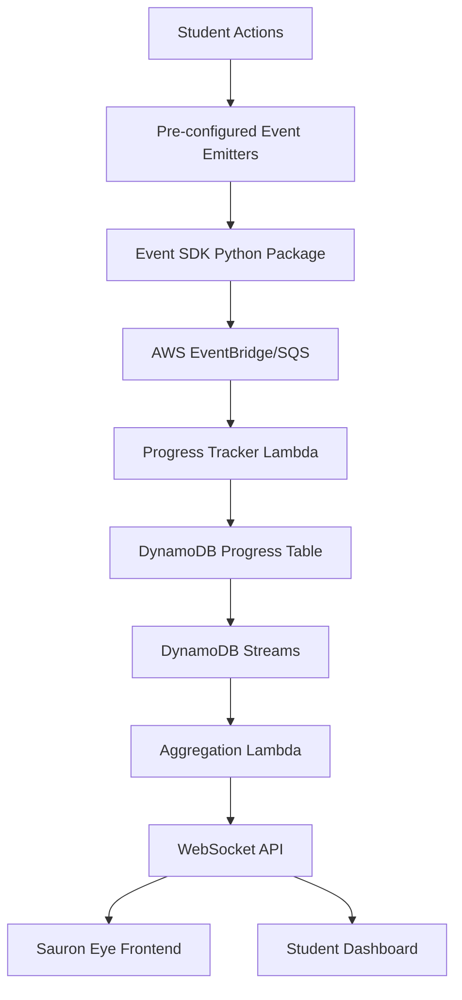

# Fellowship Tutorial: Detailed Implementation Tasks

## Table of Contents
1. [Implementation Phases](#implementation-phases)
2. [Progress Tracking Architecture](#progress-tracking-architecture)
3. [Repository Structure](#repository-structure)
4. [EC2 Instance Setup](#ec2-instance-setup)
5. [VS Code Server Configuration](#vs-code-server-configuration)
6. [Event Tracking Implementation](#event-tracking-implementation)
7. [MCP Orchestration Repository](#mcp-orchestration-repository)
8. [SUT + Playwright Test Repository](#sut--playwright-test-repository)
9. [Sauron's Eye Progress Map](#saurons-eye-progress-map)
10. [Dark Magic Challenge System](#dark-magic-challenge-system)
11. [Report Submission & Winner Detection](#report-submission--winner-detection)
12. [Testing Strategy](#testing-strategy)

---

## Implementation Phases

### Overview

The Fellowship tutorial implementation is structured in **4 phases**, prioritizing a **Minimum Viable Tutorial (MVP)** that works end-to-end, then progressively adding advanced features.

### Phase 1: MVP (Minimum Viable Tutorial) - START HERE

**Goal**: Get basic tutorial working end-to-end without events library  
**Time**: ~40-50 hours  
**Success Criteria**: Teams can complete Short Tutorial (1.5 hours)

**Critical Path Tasks:**

1. **SUT Web Application** (Task 5.1, 6.1)
   - Basic React + Flask app
   - Docker Compose setup
   - Simple functionality
   - **NO event tracking yet**

2. **Playwright Test Suite** (Task 5.2-5.4)
   - Basic test cases (3-5 tests)
   - Page Object Model (basic)
   - Pytest configuration
   - **NO event tracking hooks yet**

3. **Jenkins Setup** (Task 1.1 - partial)
   - Jenkins installation
   - Basic test pipeline
   - Manual trigger
   - **NO webhooks yet**

4. **Basic Orchestration Repository** (Task 4.2 - minimal)
   - Simple monitoring agent (direct Jenkins API, not MCP)
   - Basic agent template
   - **NO event tracking yet**
   - **NO MCP servers yet**

5. **EC2 Setup** (Task 1.1 - minimal)
   - Install base software
   - Clone repositories
   - Start services
   - **NO package installations yet** (no events, no MCPs)

**MVP Deliverables:**
- ✅ Teams can access EC2 instance
- ✅ Run tests locally
- ✅ Trigger Jenkins pipeline manually
- ✅ See basic monitoring agent working (direct API)
- ✅ Generate simple text report

**Can Be Deferred:**
- ❌ Event SDK library
- ❌ Automated event tracking
- ❌ Jenkins MCP server
- ❌ Official MCP integration
- ❌ Test generation agents
- ❌ Dark magic challenges
- ❌ Sauron's Eye
- ❌ Progress tracking infrastructure

### Phase 2: Event Tracking

**Goal**: Add automated progress tracking  
**Time**: ~20-25 hours  
**Prerequisites**: Phase 1 MVP complete

**Tasks:**

1. **Event SDK Library** (Task 3.1)
   - Create `fellowship-events` package
   - Basic event client
   - AWS EventBridge/SQS integration
   - PyPI publication

2. **Event Integration** (Task 3.2-3.4)
   - Pytest hooks for test events
   - Git hooks for code changes
   - Jenkins webhooks for pipeline events

3. **Progress Tracking Infrastructure** (Task 3.5)
   - DynamoDB setup
   - Lambda functions for processing
   - WebSocket API for real-time updates

**Can Be Deferred:**
- ❌ Jenkins MCP server
- ❌ Official MCP integration
- ❌ Test generation
- ❌ Dark magic challenges

### Phase 3: Advanced MCPs

**Goal**: Enhance MCP capabilities  
**Time**: ~25-30 hours  
**Prerequisites**: Phase 2 complete

**Tasks:**

1. **Jenkins MCP Server** (Task 4.1)
   - Create `mcp-server-jenkins` repository
   - Implement 7 MCP tools
   - Event emission hooks
   - PyPI publication

2. **Official MCP Integration** (Task 4.1b)
   - Playwright MCP configuration
   - Git MCP configuration
   - Filesystem MCP (optional)

3. **Update Orchestration** (Task 4.2-4.4)
   - Use Jenkins MCP instead of direct API
   - Integrate official MCPs
   - Enhanced agents with MCP tools

**Can Be Deferred:**
- ❌ Test generation agents
- ❌ Dark magic challenges
- ❌ Advanced reporting

### Phase 4: Advanced Features

**Goal**: Full tutorial experience  
**Time**: ~95-125 hours  
**Prerequisites**: Phase 3 complete

**Tasks:**

1. **Test Generation** (Extended - Task 4.2 extended)
   - Test Agent with Playwright MCP
   - Test generation from requirements
   - Test fixing capabilities

2. **Multi-Agent Orchestration** (Extended - Task 4.3 extended)
   - Orchestrator with multiple agents
   - Agent communication
   - Complex workflows

3. **Dark Magic Challenges** (Extended - Task 8.1-8.3)
   - SSM documents for challenges
   - Trigger Lambda
   - Instructor dashboard

4. **Advanced Reporting** (Extended - Task 9.1-9.3)
   - Report submission API
   - Quality evaluation
   - Winner detection

5. **Sauron's Eye Enhancement** (Extended - Task 7.1-7.2)
   - 3D progress map
   - Real-time updates
   - Leaderboard

### Implementation Priority Summary

**Must Complete First (MVP):**
1. SUT web application
2. Playwright test suite (basic)
3. Jenkins setup
4. Basic orchestration (monitoring agent with direct API)
5. EC2 setup

**Add After MVP Works:**
1. Event SDK library
2. Event integration
3. Progress tracking

**Add After Events Work:**
1. Jenkins MCP server
2. Official MCP integration
3. Enhanced orchestration

**Add Last (Extended Features):**
1. Test generation
2. Dark magic challenges
3. Advanced reporting
4. Sauron's Eye

---

## Progress Tracking Architecture

### Overview
Progress tracking is **event-driven** and **pre-configured** in the repositories. Teams don't need to manually emit events - they're automatically tracked through:

1. **Pre-configured event emitters** in the codebase (Python SDK)
2. **Git hooks** that track repository actions
3. **Jenkins webhooks** that track test executions
4. **MCP server hooks** that track MCP interactions
5. **CLI tools** that wrap common operations

### Event Flow Architecture



### Event Types & Pre-configuration

All events are emitted through a **pre-configured Python SDK** (`fellowship-events`) that teams import and use. The SDK handles authentication, batching, and retry logic automatically.

**Event Categories:**

1. **Environment Events** (Auto-emitted on setup)
   - `team.registered` - When team gets environment credentials
   - `environment.accessed` - First SSH/VS Code connection
   - `repository.cloned` - When repos are cloned

2. **MCP Events** (Pre-configured in MCP orchestration repo)
   - `mcp.server.installed` - MCP server package installed
   - `mcp.server.connected` - MCP server connected to agent
   - `mcp.tool.invoked` - MCP tool called (e.g., get_jenkins_status)
   - `mcp.agent.created` - Monitoring agent created

3. **Test Events** (Pre-configured in Playwright repo)
   - `test.suite.executed` - Test suite run (via pytest hooks)
   - `test.case.created` - New test file created (via git hooks)
   - `test.case.fixed` - Test file modified after failure (via git hooks)
   - `test.result.passed` - Individual test passed
   - `test.result.failed` - Individual test failed

4. **Jenkins Events** (Via webhook integration)
   - `jenkins.job.triggered` - Pipeline started
   - `jenkins.job.completed` - Pipeline finished
   - `jenkins.job.failed` - Pipeline failed
   - `jenkins.monitored` - Agent detected Jenkins activity

5. **Dark Magic Events** (Auto-detected)
   - `dark_magic.detected` - Team detected infrastructure issue
   - `dark_magic.resolved` - Team fixed infrastructure issue
   - `dark_magic.test.created` - Test case created for dark magic

6. **Milestone Events** (Auto-calculated)
   - `milestone.environment_setup` - Environment ready
   - `milestone.mcp_connected` - MCP working
   - `milestone.first_test` - First test executed
   - `milestone.monitoring_active` - Monitoring agent running
   - `milestone.report_generated` - Report created

---

## Repository Structure

### Overview
Two separate repositories will be provided to each team:

1. **`fellowship-tests`** - Playwright test suite (Python)
2. **`fellowship-mcp-agent`** - MCP orchestration and monitoring agent (Python)

Both repositories are **pre-configured** with:
- Event tracking SDK
- Git hooks for automatic event emission
- VS Code devcontainer configuration
- Sample code and documentation
- CI/CD integration (Jenkins webhooks)

### Repository 1: `fellowship-tests`

**Purpose:** Playwright test automation repository

**Structure:**
```
fellowship-tests/
├── .devcontainer/
│   ├── devcontainer.json          # VS Code devcontainer config
│   └── Dockerfile                 # Python + Playwright environment
├── .git/
│   └── hooks/
│       ├── post-commit           # Emit test.case.created events
│       └── post-merge            # Emit repository.cloned events
├── tests/
│   ├── __init__.py
│   ├── conftest.py               # Pytest config + event hooks
│   ├── test_login.py            # Sample test (pre-configured)
│   ├── test_dashboard.py        # Sample test (pre-configured)
│   └── test_api.py              # Sample test (pre-configured)
├── playwright/
│   ├── fixtures.py              # Playwright fixtures
│   └── page_objects/            # Page Object Model
│       ├── login_page.py
│       └── dashboard_page.py
├── requirements.txt              # Python dependencies
├── pytest.ini                   # Pytest configuration
├── .env.example                 # Environment variables template
├── README.md                    # Setup instructions
└── fellowship_events/           # Event SDK (pre-installed)
    ├── __init__.py
    ├── client.py                # Event client
    └── hooks.py                 # Pytest hooks integration
```

**Key Pre-configurations:**
- `conftest.py` includes pytest hooks that automatically emit events on test execution
- Git hooks emit events when tests are created/modified
- Event SDK is pre-installed and configured with team credentials

### Repository 2: `fellowship-mcp-agent`

**Purpose:** MCP orchestration and monitoring agent

**Structure:**
```
fellowship-mcp-agent/
├── .devcontainer/
│   ├── devcontainer.json          # VS Code devcontainer config
│   └── Dockerfile                 # Python + LangChain environment
├── .git/
│   └── hooks/
│       └── post-merge            # Emit repository.cloned events
├── src/
│   ├── __init__.py
│   ├── mcp_servers/
│   │   ├── __init__.py
│   │   ├── jenkins_mcp.py        # Jenkins MCP server (template)
│   │   └── test_mcp.py           # Test management MCP server (template)
│   ├── agents/
│   │   ├── __init__.py
│   │   ├── monitoring_agent.py   # Jenkins monitoring agent (template)
│   │   └── test_agent.py         # Test generation/fixing agent (template)
│   ├── orchestrator.py           # Main orchestrator (LangChain)
│   └── config.py                 # Configuration management
├── scripts/
│   ├── setup_mcp.sh              # MCP server setup script
│   └── start_agent.sh            # Start monitoring agent
├── requirements.txt              # Python dependencies
├── .env.example                  # Environment variables template
├── README.md                     # Setup instructions
└── fellowship_events/           # Event SDK (pre-installed)
    ├── __init__.py
    ├── client.py                # Event client
    └── mcp_hooks.py             # MCP integration hooks
```

**Key Pre-configurations:**
- MCP server templates with event emission hooks
- LangChain agent templates with event tracking
- Event SDK pre-configured to emit MCP-related events

---

## EC2 Instance Setup

### Enhanced user_data.sh

The EC2 instance will be pre-configured with:

1. **Base Software:**
   - Docker & Docker Compose
   - Git
   - Python 3.11+
   - Node.js 20+ (for VS Code Server)
   - VS Code Server (code-server)

2. **Services:**
   - Jenkins (pre-configured with sample jobs)
   - MailHog (email testing)
   - SUT (System Under Test - web application)
   - PostgreSQL (for SUT database)

3. **Development Environment:**
   - VS Code Server with extensions
   - **Repositories:**
     - `fellowship-orchestration` (cloned from GitHub)
     - `fellowship-sut` (copied from workshop directory or S3)
   - **Packages Installed:**
     - `fellowship-events` (from PyPI)
     - `mcp-server-jenkins` (from PyPI or repository)
     - Official MCPs (Playwright, Git, Filesystem)
   - Devcontainer support
   - Pre-configured SSH keys

4. **Event Tracking Infrastructure:**
   - AWS CLI configured with IAM role
   - `fellowship-events` package installed (from PyPI)
   - Team credentials in environment variables

### Implementation Tasks

#### Task 1.1: Update Fellowship user_data.sh
**Phase**: 1 (MVP) - Critical Path  
**File:** `iac/aws/workshops/fellowship/user_data.sh`

**MVP Requirements (Phase 1):**
- Install Python 3.11, Node.js 20, VS Code Server
- Install Docker, Docker Compose
- Set up Jenkins with pre-configured jobs
- Set up SUT (web application from `fellowship-sut`)
- Set up PostgreSQL for SUT
- **Clone Repositories:**
  - Clone `fellowship-orchestration` from GitHub (basic version)
  - Copy `fellowship-sut` from workshop directory or S3
- **MVP: Skip package installations** (no events, no MCPs yet)
- Configure VS Code Server with extensions
- Set up environment variables for team credentials

**Phase 2+ Requirements (Add Later):**
- Install `fellowship-events` from PyPI: `pip install fellowship-events`
- Install `mcp-server-jenkins` from PyPI: `pip install mcp-server-jenkins` (Phase 3)
- Install official MCPs (Playwright, Git, Filesystem) (Phase 3)

**Estimated Time:** 
- MVP: 4-6 hours
- Phase 2+: +1-2 hours

---

## VS Code Server Configuration

### Pre-configured Extensions

VS Code Server will come with these extensions pre-installed:

**Python Development:**
- `ms-python.python` - Python language support
- `ms-python.vscode-pylance` - Python language server
- `ms-python.black-formatter` - Code formatting
- `ms-python.isort` - Import sorting

**Playwright:**
- `ms-playwright.playwright` - Playwright extension

**Devcontainers:**
- `ms-vscode-remote.remote-containers` - Devcontainer support

**Git:**
- `eamodio.gitlens` - Git integration

**Other:**
- `ms-vscode.vscode-json` - JSON support
- `redhat.vscode-yaml` - YAML support

### Devcontainer Configuration

Each repository includes a `.devcontainer/devcontainer.json` that:
- Sets up Python environment
- Installs dependencies automatically
- Configures VS Code settings
- Pre-configures event tracking

**Example devcontainer.json for fellowship-tests:**
```json
{
  "name": "Fellowship Tests",
  "image": "mcr.microsoft.com/devcontainers/python:3.11",
  "features": {
    "ghcr.io/devcontainers/features/node:1": {
      "version": "20"
    }
  },
  "customizations": {
    "vscode": {
      "extensions": [
        "ms-python.python",
        "ms-python.vscode-pylance",
        "ms-playwright.playwright"
      ],
      "settings": {
        "python.defaultInterpreterPath": "/usr/local/bin/python",
        "python.formatting.provider": "black"
      }
    }
  },
  "postCreateCommand": "pip install -r requirements.txt && playwright install",
  "remoteUser": "ec2-user"
}
```

### Implementation Tasks

#### Task 2.1: Create VS Code Server Installation Script
**Phase**: 1 (MVP) - Critical Path  
**File:** `iac/aws/workshops/fellowship/scripts/install_vscode_server.sh`

**Requirements:**
- Download and install code-server
- Install required extensions
- Configure code-server settings
- Set up authentication (password from Secrets Manager)
- Create systemd service for code-server

**Estimated Time:** 2-3 hours

#### Task 2.2: Create Devcontainer Configurations
**Phase**: 1 (MVP) - Can be simplified for MVP  
**Files:**
- `iac/aws/workshops/fellowship/fellowship-sut/.devcontainer/devcontainer.json`
- `fellowship-orchestration/.devcontainer/devcontainer.json` (if needed)

**MVP Requirements:**
- Python 3.11 environment
- Pre-installed dependencies
- VS Code extensions
- **NO Event SDK pre-configuration yet** (add in Phase 2)

**Phase 2+ Requirements:**
- Event SDK pre-configured

**Estimated Time:** 2 hours

---

## Event Tracking Implementation

### Event SDK Package

A Python package `fellowship-events` will be created and pre-installed in both repositories.

**Package Structure:**
```
fellowship-events/
├── setup.py
├── README.md
├── fellowship_events/
│   ├── __init__.py
│   ├── client.py              # Main event client
│   ├── config.py             # Configuration management
│   ├── batch.py              # Event batching
│   └── retry.py              # Retry logic
└── tests/
    └── test_client.py
```

**Key Features:**
- Automatic authentication via IAM role or credentials
- Event batching (send multiple events in one request)
- Retry logic with exponential backoff
- Thread-safe for concurrent operations
- Context manager support for automatic flushing

**Usage Example:**
```python
from fellowship_events import EventClient

# Initialize client (reads team_id from environment)
client = EventClient()

# Emit event
client.emit('test.suite.executed', {
    'test_count': 10,
    'passed': 8,
    'failed': 2,
    'duration': 45.2
})

# Or use as context manager (auto-flush on exit)
with EventClient() as client:
    client.emit('mcp.server.connected', {'server': 'jenkins'})
```

### Integration Points

#### 1. Pytest Hooks (fellowship-tests)

**File:** `fellowship-tests/tests/conftest.py`

```python
import pytest
from fellowship_events import EventClient

@pytest.hookimpl(tryfirst=True)
def pytest_runtest_setup(item):
    """Emit event when test starts"""
    client = EventClient()
    client.emit('test.case.started', {
        'test_name': item.name,
        'test_file': str(item.fspath)
    })

@pytest.hookimpl(tryfirst=True)
def pytest_runtest_logreport(report):
    """Emit event when test completes"""
    if report.when == 'call':  # Only on actual test execution
        client = EventClient()
        event_type = 'test.result.passed' if report.passed else 'test.result.failed'
        client.emit(event_type, {
            'test_name': report.nodeid,
            'duration': report.duration,
            'error': str(report.longrepr) if report.failed else None
        })

def pytest_sessionfinish(session, exitstatus):
    """Emit event when test suite completes"""
    client = EventClient()
    client.emit('test.suite.executed', {
        'total_tests': session.testscollected,
        'passed': session.testsfailed,
        'failed': exitstatus
    })
```

#### 2. Git Hooks (Both Repositories)

**File:** `.git/hooks/post-commit` (auto-generated during setup)

```bash
#!/bin/bash
# Emit event when test file is created/modified

# Get changed files
CHANGED_FILES=$(git diff-tree --no-commit-id --name-only -r HEAD)

# Check if any test files were changed
if echo "$CHANGED_FILES" | grep -q "tests/.*\.py$"; then
    python3 -c "
from fellowship_events import EventClient
import os

client = EventClient()
client.emit('test.case.created', {
    'files': '$CHANGED_FILES'.split('\n')
})
"
fi
```

#### 3. MCP Server Hooks (fellowship-mcp-agent)

**File:** `fellowship-mcp-agent/src/mcp_servers/jenkins_mcp.py`

```python
from fellowship_events import EventClient

class JenkinsMCPServer:
    def __init__(self):
        self.event_client = EventClient()
    
    async def get_jenkins_status(self, job_name: str):
        # Emit event when MCP tool is invoked
        self.event_client.emit('mcp.tool.invoked', {
            'tool': 'get_jenkins_status',
            'parameters': {'job_name': job_name}
        })
        
        # Actual MCP tool implementation
        result = await self._fetch_jenkins_status(job_name)
        
        return result
```

#### 4. Jenkins Webhook Integration

**File:** Lambda function that receives Jenkins webhooks

Jenkins will be configured to send webhooks to an API Gateway endpoint that triggers a Lambda function to emit events.

### Implementation Tasks

#### Task 3.1: Create Event SDK Package
**Location:** New package `fellowship-events/`

**Requirements:**
- Python package with setup.py
- Event client with batching and retry
- Configuration via environment variables
- AWS EventBridge/SQS integration
- Comprehensive error handling
- Unit tests

**Estimated Time:** 6-8 hours

#### Task 3.2: Create Pytest Integration
**Phase**: 2 (Event Tracking) - Can be deferred after MVP  
**Repository:** `fellowship-sut`

**File:** `tests/conftest.py`

**Requirements:**
- Pytest hooks for test execution events
- Automatic event emission (depends on `fellowship-events`)
- Error handling (don't fail tests if events fail)

**MVP Note**: For MVP, tests can run without event hooks. Add this in Phase 2.

**Estimated Time:** 2-3 hours

#### Task 3.3: Create Git Hooks
**Phase**: 2 (Event Tracking) - Can be deferred after MVP  
**Files:** `.git/hooks/post-commit`, `.git/hooks/post-merge`

**Requirements:**
- Detect test file changes
- Emit appropriate events (depends on `fellowship-events`)
- Handle errors gracefully

**MVP Note**: For MVP, git hooks are not required. Can be added in Phase 2.

**Estimated Time:** 2 hours

#### Task 3.4: Create Jenkins Webhook Integration
**Phase**: 2 (Event Tracking) - Can be deferred after MVP  
**Files:**
- `functions/aws/fellowship/jenkins_webhook_handler.py`
- `iac/aws/workshops/fellowship/jenkins_webhook.tf`

**Requirements:**
- API Gateway endpoint for webhooks
- Lambda function to process webhooks
- Emit events for Jenkins job status (depends on `fellowship-events`)
- Configure Jenkins to send webhooks

**MVP Note**: For MVP, manual Jenkins triggering is sufficient. Webhooks can be added in Phase 2.

**Estimated Time:** 4-5 hours

#### Task 3.5: Create Progress Tracking Infrastructure
**Phase**: 2 (Event Tracking) - Can be deferred after MVP  
**Files:**
- `iac/aws/workshops/fellowship/progress_tracking.tf`
- `functions/aws/fellowship/progress_tracker.py`

**Requirements:**
- DynamoDB table for progress events
- EventBridge rule for event processing
- Lambda function to aggregate progress
- Real-time WebSocket API for updates

**MVP Note**: For MVP, progress tracking is not required. Teams can manually track progress or use simple dashboard. Add this in Phase 2.

**Estimated Time:** 8-10 hours

---

## Repository Structure

### Four Separate Repositories

1. **`mcp-server-jenkins`** - Jenkins MCP Server (Public Repository)
   - Standalone MCP server for Jenkins CI/CD
   - Published to PyPI: `pip install mcp-server-jenkins`
   - Location: `https://github.com/testingfantasy/mcp-server-jenkins`

2. **`fellowship-orchestration`** - MCP Orchestration (Public Repository)
   - LangChain/LangGraph orchestration workflows
   - Agent templates and orchestrator
   - Location: `https://github.com/testingfantasy/fellowship-orchestration`

3. **`fellowship-events`** - Event Tracking SDK (Public Repository, PyPI)
   - Event client implementation
   - Published to PyPI: `pip install fellowship-events`
   - Location: `https://github.com/testingfantasy/fellowship-events`

4. **`fellowship-sut`** - SUT + Playwright Tests (Workshop Directory)
   - System Under Test web application
   - Playwright test suite
   - Location: `iac/aws/workshops/fellowship/fellowship-sut/`

## MCP Orchestration Repository (fellowship-orchestration)

### Pre-configured Components

#### 1. MCP Server Integration

**Official MCP Servers** (Use where available):
- **Playwright MCP** (`@playwright/mcp`) - Official, for test generation and browser automation
- **Git MCP** (`mcp-server-git`) - Official, for repository management
- **Filesystem MCP** (`@modelcontextprotocol/server-filesystem`) - Official, optional for file operations

**Custom MCP Servers** (Installed separately):
- **Jenkins MCP Server** (`mcp-server-jenkins`):
  - Installed via: `pip install mcp-server-jenkins`
  - Tools: `get_jenkins_status`, `trigger_jenkins_job`, `get_jenkins_logs`
  - Pre-configured with Jenkins URL and credentials
  - Event emission hooks integrated
  - **Note**: No official Jenkins MCP exists - see [JENKINS_MCP_ANALYSIS.md](JENKINS_MCP_ANALYSIS.md)

**Note**: Teams use official Playwright MCP instead of custom test management MCP. Custom test management MCP is removed in favor of official Playwright MCP.

#### 2. LangChain Agent Templates

**Monitoring Agent** (`src/agents/monitoring_agent.py`):
- Watches Jenkins pipelines
- Generates reports on test results
- Uses Jenkins MCP server
- Emits events for monitoring activities

**Test Agent** (`src/agents/test_agent.py`):
- Generates test cases from requirements
- Fixes failing tests
- Uses official Playwright MCP (`@playwright/mcp`) for test operations
- Emits events for test generation/fixing

#### 3. Orchestrator

**Main Orchestrator** (`src/orchestrator.py`):
- Coordinates multiple agents
- Manages agent communication
- Handles agent lifecycle
- Emits orchestration events

### Implementation Tasks

#### Task 4.1: Create Jenkins MCP Server Repository
**Phase**: 3 (Advanced MCPs) - Can be deferred after MVP and Events  
**Repository:** `mcp-server-jenkins` (separate public repository)

**Files:**
- `src/mcp_server_jenkins/` - MCP server implementation
- `setup.py` - PyPI package configuration
- `README.md` - Documentation
- `tests/` - Unit tests

**Requirements:**
- MCP server implementation using MCP Python SDK
- 7 MCP tools for Jenkins interaction:
  - `get_jenkins_job_status`
  - `trigger_jenkins_job`
  - `get_jenkins_build_logs`
  - `get_jenkins_job_history`
  - `analyze_jenkins_failure`
  - `get_jenkins_console_output`
  - `cancel_jenkins_build`
- Event emission hooks (depends on `fellowship-events` - Phase 2)
- Error handling
- Comprehensive documentation
- PyPI package setup
- MCP registry submission files
- **See**: [JENKINS_MCP_ANALYSIS.md](JENKINS_MCP_ANALYSIS.md) for analysis

**MVP Note**: For MVP, use direct Jenkins REST API instead of MCP. This task can be deferred to Phase 3.

**Estimated Time:** 8-10 hours

#### Task 4.1b: Integrate Official MCP Servers in Orchestration Repository
**Repository:** `fellowship-orchestration`

**Files:**
- `src/config/mcp_config.json` - Official MCP configuration
- `README.md` - Installation instructions

**Requirements:**
- Configure official Playwright MCP (`@playwright/mcp`)
- Configure official Git MCP (`mcp-server-git`)
- Configure official Filesystem MCP (optional)
- Document installation and configuration
- Update dependencies to use `mcp-server-jenkins` from PyPI

**Estimated Time:** 2-3 hours

#### Task 4.2: Create LangChain Agent Templates
**Phase**: 1 (MVP) for Monitoring Agent, Phase 4 (Extended) for Test Agent  
**Repository:** `fellowship-orchestration`

**Files:**
- `src/agents/monitoring_agent.py` - **MVP: Phase 1**
- `src/agents/test_agent.py` - **Extended: Phase 4**

**MVP Requirements (Phase 1 - Monitoring Agent Only):**
- LangChain agent setup
- **Direct Jenkins API Integration** (not MCP):
  - Use Jenkins REST API directly
  - Simple polling mechanism
  - Basic monitoring functionality
- Prompt engineering for monitoring agent
- **NO event emission hooks yet** (add in Phase 2)
- Error handling and retry logic

**Phase 3+ Requirements (Add MCP Integration):**
- **Custom MCP Integration:**
  - Use `mcp-server-jenkins` (installed via pip)
  - Convert Jenkins MCP tools to LangChain tools
- **Official MCP Integration** (Phase 3):
  - Convert official Playwright MCP tools to LangChain tools
  - Convert official Git MCP tools to LangChain tools
  - Integrate with MCP client (VS Code/Cursor/Claude Desktop)

**Phase 4 Requirements (Test Agent - Extended):**
- Test Agent with Playwright MCP
- Test generation capabilities
- Test fixing capabilities

**Estimated Time:** 
- MVP (Monitoring Agent only): 6-8 hours
- Phase 3 (Add MCPs): +2-3 hours
- Phase 4 (Test Agent): +4-6 hours

#### Task 4.3: Create Orchestrator
**Phase**: 4 (Advanced Features) - Extended, can be deferred  
**Repository:** `fellowship-orchestration`

**File:** `src/orchestrator.py`

**Requirements:**
- Multi-agent orchestration
- Agent communication
- Lifecycle management
- Event emission (depends on `fellowship-events` - Phase 2)

**MVP Note**: For MVP, a simple monitoring agent is sufficient. Multi-agent orchestration can be deferred to Phase 4.

**Estimated Time:** 6-8 hours

#### Task 4.4: Create Setup Scripts
**Phase**: 1 (MVP) for basic setup, Phase 3+ for MCP setup  
**Repository:** `fellowship-orchestration`

**Files:**
- `scripts/setup_mcp.sh`
- `scripts/start_agent.sh`

**MVP Requirements (Phase 1):**
- Configure Jenkins credentials (direct API)
- Start monitoring agent (direct API)
- Verify setup
- **NO package installations yet**

**Phase 2 Requirements (Add Event SDK):**
- Install `fellowship-events` from PyPI: `pip install fellowship-events`

**Phase 3 Requirements (Add MCPs):**
- Install `mcp-server-jenkins` from PyPI: `pip install mcp-server-jenkins`
- Install official MCP servers:
  - Install `@playwright/mcp` via npm
  - Install `mcp-server-git` via uvx/pip
  - Install `@modelcontextprotocol/server-filesystem` (optional)
- Configure MCP Clients:
  - Configure VS Code/Cursor MCP client settings
  - Configure Claude Desktop MCP settings (if used)

**Estimated Time:** 
- MVP: 1-2 hours
- Phase 2+: +2-3 hours

---

## SUT + Playwright Test Repository (fellowship-sut)

### Pre-configured Components

#### 1. System Under Test (SUT)

**Web Application:**
- Simple but realistic web application for testing
- Docker Compose setup
- Pre-configured with database

#### 2. Sample Test Cases

**Basic Tests** (pre-configured, some intentionally failing):
- `tests/test_login.py` - Login functionality (1 passing, 1 failing test)
- `tests/test_dashboard.py` - Dashboard functionality (2 passing tests)
- `tests/test_api.py` - API endpoints (1 passing, 1 failing test)

#### 3. Page Object Model

**Page Objects:**
- `playwright/page_objects/login_page.py`
- `playwright/page_objects/dashboard_page.py`

#### 4. Fixtures

**Playwright Fixtures:**
- Browser setup/teardown
- Test data management
- Screenshot on failure
- Video recording (optional)

### Implementation Tasks

#### Task 5.1: Create SUT Web Application
**Phase**: 1 (MVP) - Critical Path  
**Repository:** `fellowship-sut` (in `iac/aws/workshops/fellowship/fellowship-sut/`)

**Files:**
- `docker-compose.yml` - SUT application stack
- `sut/` - Web application code
- `README.md` - SUT documentation

**MVP Requirements (Phase 1):**
- Simple but realistic web application
- Docker Compose setup
- Database integration (basic)
- API endpoints for testing (3-5 endpoints)
- Pre-configured with seed data
- **NO event tracking integration yet**

**Estimated Time:** 6-8 hours

#### Task 5.2: Create Sample Test Cases
**Phase**: 1 (MVP) - Critical Path  
**Repository:** `fellowship-sut`

**Files:**
- `tests/test_login.py`
- `tests/test_dashboard.py`
- `tests/test_api.py`

**MVP Requirements (Phase 1):**
- Mix of passing and failing tests (3-5 tests total)
- Realistic test scenarios
- Good examples for attendees to learn from
- Some tests should be fixable with MCP assistance (for Phase 4)
- **NO event tracking hooks yet** (add in Phase 2)

**Phase 2 Requirements (Add Event Tracking):**
- Event tracking hooks integrated (depends on `fellowship-events`)

**Estimated Time:** 
- MVP: 4-6 hours
- Phase 2: +1 hour (add event hooks)

#### Task 5.3: Create Page Object Model
**Phase**: 1 (MVP) - Critical Path  
**Repository:** `fellowship-sut`

**Files:**
- `playwright/page_objects/login_page.py`
- `playwright/page_objects/dashboard_page.py`

**Requirements:**
- Clean page object pattern
- Reusable components
- Good documentation

**Estimated Time:** 3-4 hours

#### Task 5.4: Create Pytest Configuration
**Phase**: 1 (MVP) for basic config, Phase 2 for event hooks  
**Repository:** `fellowship-sut`

**File:** `pytest.ini` and `tests/conftest.py`

**MVP Requirements (Phase 1):**
- Playwright configuration
- Test discovery patterns
- Reporting configuration
- **NO event hook integration yet** (add in Phase 2)

**Phase 2 Requirements:**
- Event hook integration (depends on `fellowship-events`)

**Estimated Time:** 
- MVP: 2 hours
- Phase 2: +1 hour (add event hooks)

---

## Event SDK Repository (fellowship-events)

### Pre-configured Components

#### 1. Event Client

**Event SDK Package:**
- Python package for event tracking
- Published to PyPI: `pip install fellowship-events`
- Used by all repositories

**Key Features:**
- Automatic authentication via IAM role or credentials
- Event batching (send multiple events in one request)
- Retry logic with exponential backoff
- Thread-safe for concurrent operations
- Context manager support for automatic flushing

### Implementation Tasks

#### Task 3.1: Create Event SDK Package
**Phase**: 2 (Event Tracking) - Can be deferred after MVP  
**Repository:** `fellowship-events` (separate public repository)

**Files:**
- `fellowship_events/__init__.py`
- `fellowship_events/client.py` - Main event client
- `fellowship_events/config.py` - Configuration management
- `fellowship_events/batch.py` - Event batching
- `fellowship_events/retry.py` - Retry logic
- `setup.py` - PyPI package configuration
- `tests/` - Unit tests
- `README.md` - Documentation

**Requirements:**
- Python package with setup.py
- Event client with batching and retry
- Configuration via environment variables
- AWS EventBridge/SQS integration
- Comprehensive error handling
- Unit tests
- PyPI publication setup

**MVP Note**: This task can be deferred. MVP can work with manual event tracking or simple CLI tool.

**Estimated Time:** 6-8 hours

---

## SUT (System Under Test) - Part of fellowship-sut Repository

### Web Application

A simple but realistic web application will be provided for testing.

**Technology Stack:**
- **Frontend:** React + TypeScript
- **Backend:** Python Flask
- **Database:** PostgreSQL
- **Deployment:** Docker Compose

**Features:**
- User authentication (login/logout)
- Dashboard with user data
- API endpoints for data management
- Admin panel (optional)

### Implementation Tasks

#### Task 6.1: Create SUT Application
**Location:** `iac/aws/workshops/fellowship/fellowship-sut/` (workshop directory)

**Requirements:**
- React frontend
- Flask backend
- PostgreSQL database
- Docker Compose setup
- Realistic functionality for testing
- Some intentional bugs for dark magic challenges

**Estimated Time:** 8-10 hours

#### Task 6.2: Integrate SUT into EC2 Setup
**Phase**: 1 (MVP) - Critical Path  
**File:** `iac/aws/workshops/fellowship/user_data.sh`

**Repository:** `fellowship-sut` (in `iac/aws/workshops/fellowship/fellowship-sut/`)

**MVP Requirements (Phase 1):**
- Copy `fellowship-sut` repository to EC2 instance (from workshop directory or S3)
- Deploy SUT via Docker Compose
- Set up database with seed data
- Configure environment variables
- Expose SUT on port 3000
- **NO event tracking package yet** (add in Phase 2)

**Phase 2 Requirements:**
- Install `fellowship-events` package for test event tracking

**Estimated Time:** 
- MVP: 2-3 hours
- Phase 2: +0.5 hours (add event package)

---

## Sauron's Eye Progress Map

### Enhanced Visualization

The existing Sauron's Eye will be enhanced with:
- Real-time progress map showing all teams
- Team positions on Middle-earth journey
- Leaderboard overlay
- Team detail view on click
- WebSocket integration for real-time updates

### Implementation Tasks

#### Task 7.1: Enhance Sauron Eye HTML
**Phase**: 4 (Advanced Features) - Extended, can be deferred  
**File:** `sauron_eye/sauron_fellowship.html` (new file)

**Requirements:**
- 3D Middle-earth map
- Team visualization (rings moving along path)
- Color coding by progress
- Click to view team details
- Leaderboard sidebar
- WebSocket connection for real-time updates (depends on Phase 2)

**MVP Note**: For MVP, Sauron's Eye is not required. Can use simple dashboard or skip entirely. Add in Phase 4.

**Estimated Time:** 12-15 hours

#### Task 7.2: Create Progress Map Backend
**Phase**: 4 (Advanced Features) - Extended, can be deferred  
**Files:**
- `functions/aws/fellowship/progress_map_api.py`
- `iac/aws/workshops/fellowship/progress_map_api.tf`

**Requirements:**
- WebSocket API for real-time updates (depends on Phase 2)
- Team progress aggregation
- Map position calculation
- Leaderboard generation

**MVP Note**: For MVP, progress map is not required. Can be added in Phase 4.

**Estimated Time:** 6-8 hours

---

## Dark Magic Challenge System

### Challenge Implementation

Each challenge is implemented as:
1. **SSM Document** - AWS Systems Manager document that executes the challenge
2. **Lambda Function** - Triggered by instructor or schedule
3. **Detection Mechanism** - How teams can detect the challenge
4. **Resolution Guide** - How to fix (for validation)

### Implementation Tasks

#### Task 8.1: Create SSM Documents for Challenges
**Phase**: 4 (Advanced Features) - Extended, can be deferred  
**Files:**
- `iac/aws/workshops/fellowship/ssm_documents/` (directory)
  - `block_database.tf`
  - `stop_jenkins.tf`
  - `rotate_secrets.tf`
  - `inject_latency.tf`
  - `corrupt_test_file.tf`
  - etc.

**Requirements:**
- SSM documents for each challenge type
- Parameterized by team_id
- Reversible (can undo the challenge)
- Safe error handling

**MVP Note**: Dark magic challenges are not required for MVP. Can be added in Phase 4 for Full Tutorial.

**Estimated Time:** 8-10 hours

#### Task 8.2: Create Dark Magic Trigger Lambda
**Phase**: 4 (Advanced Features) - Extended, can be deferred  
**Files:**
- `functions/aws/fellowship/dark_magic_trigger.py`
- `iac/aws/workshops/fellowship/dark_magic_trigger.tf`

**Requirements:**
- API endpoint for instructor to trigger challenges
- Support for single team or all teams
- Scheduled challenge support
- Challenge validation and logging

**MVP Note**: Dark magic challenges are not required for MVP. Can be added in Phase 4 for Full Tutorial.

**Estimated Time:** 6-8 hours

#### Task 8.3: Create Instructor Dashboard for Challenges
**Phase**: 4 (Advanced Features) - Extended, can be deferred  
**Files:**
- `frontend/ec2-manager/src/pages/DarkMagicDashboard.jsx`
- `frontend/ec2-manager/src/services/darkMagicApi.js`

**Requirements:**
- List of available challenges
- Trigger challenges for specific teams
- Schedule challenges
- View challenge status
- Undo challenges

**MVP Note**: Dark magic dashboard is not required for MVP. Can be added in Phase 4.

**Estimated Time:** 8-10 hours

---

## Report Submission & Winner Detection

### Report Requirements

Teams must submit a comprehensive report with:
1. Executive Summary
2. Test Suite Overview
3. MCP Integration Summary
4. Dark Magic Challenges Detected
5. Dark Magic Challenges Resolved
6. Test Cases Generated
7. Test Cases Fixed
8. Monitoring Agent Capabilities
9. Recommendations
10. Appendix (code snippets)

### Implementation Tasks

#### Task 9.1: Create Report Submission API
**Phase**: 1 (MVP) for basic submission, Phase 4 for advanced  
**Files:**
- `functions/aws/fellowship/report_submission.py`
- `iac/aws/workshops/fellowship/report_submission.tf`

**MVP Requirements (Phase 1):**
- Simple API endpoint for report submission (text/markdown)
- Store report in S3
- Store metadata in DynamoDB
- **NO validation yet** (add in Phase 4)
- **NO winner evaluation yet** (add in Phase 4)

**Phase 4 Requirements:**
- Report validation (check required sections)
- Trigger winner evaluation

**Estimated Time:** 
- MVP: 2-3 hours
- Phase 4: +2-3 hours

#### Task 9.2: Create Report Quality Evaluator
**Phase**: 4 (Advanced Features) - Extended, can be deferred  
**File:** `functions/aws/fellowship/report_evaluator.py`

**Requirements:**
- Parse markdown/HTML reports
- Check for required sections
- Evaluate content quality
- Calculate report score
- Store evaluation results

**MVP Note**: For MVP, simple report submission is sufficient. Quality evaluation can be added in Phase 4.

**Estimated Time:** 6-8 hours

#### Task 9.3: Create Winner Detection System
**Phase**: 4 (Advanced Features) - Extended, can be deferred  
**File:** `functions/aws/fellowship/winner_detector.py`

**Requirements:**
- Aggregate team scores (depends on Phase 2 for event tracking)
- Calculate final scores (progress + report + dark magic + time)
- Determine winner
- Update DynamoDB with winner status
- Provide API endpoint for winner query

**MVP Note**: For MVP, winner detection is not required. Can be added in Phase 4.

**Estimated Time:** 4-6 hours

---

## Testing Strategy

### Pre-Tutorial Testing Phases

#### Phase 1: Unit Testing (Week 1-2)
- Test event SDK package
- Test pytest hooks integration
- Test git hooks
- Test MCP server templates
- Test LangChain agents

**Success Criteria:**
- All unit tests pass
- Code coverage > 80%

#### Phase 2: Integration Testing (Week 3-4)
- Test event flow end-to-end
- Test progress tracking
- Test Sauron's Eye updates
- Test dark magic challenges
- Test report submission

**Success Criteria:**
- Events flow correctly through system
- Progress updates in real-time
- Challenges trigger and resolve correctly
- Reports are evaluated accurately

#### Phase 3: Dry Run Testing (Week 5-6)

**3.1: Single Team Dry Run**
- Deploy one EC2 instance
- One team completes full tutorial
- Monitor all systems
- Gather feedback

**Success Criteria:**
- Tutorial completable in 4-6 hours
- All events tracked correctly
- Progress visible in real-time
- Dark magic challenges work
- Report submission works

**3.2: Multi-Team Dry Run (5-10 teams)**
- Deploy multiple EC2 instances
- Multiple teams complete tutorial simultaneously
- Test scalability
- Test Sauron's Eye with multiple teams
- Test dark magic challenges for multiple teams

**Success Criteria:**
- System handles 10 teams simultaneously
- No performance issues
- Sauron's Eye displays all teams correctly
- Winner detection works correctly

**3.3: Full Scale Test (20-30 teams)**
- Deploy 20-30 EC2 instances
- Test at scale
- Monitor resource usage
- Test edge cases

**Success Criteria:**
- System handles 30 teams
- No resource exhaustion
- All features work at scale

### Testing Infrastructure

#### Test Environment Setup

**Separate AWS Account/Environment:**
- `fellowship-test` environment
- Isolated from production
- Same infrastructure as production
- Test data and cleanup scripts

#### Test Data Management

**Test Teams:**
- Pre-created test teams with credentials
- Test event data
- Test progress data
- Test reports

#### Automated Testing

**CI/CD Pipeline:**
- Unit tests run on every commit
- Integration tests run on PR
- Dry run tests run weekly
- Performance tests before tutorial

### Implementation Tasks

#### Task 10.1: Create Unit Tests
**Phase**: 1 (MVP) for core tests, Phase 2+ for additional tests  
**Files:**
- `fellowship-orchestration/tests/` (orchestration repository) - **Phase 1**
- `iac/aws/workshops/fellowship/fellowship-sut/tests/unit/` (SUT repository) - **Phase 1**
- `fellowship-events/tests/` (event SDK repository) - **Phase 2**
- `mcp-server-jenkins/tests/` (Jenkins MCP repository) - **Phase 3**

**MVP Requirements (Phase 1):**
- Unit tests for SUT application
- Unit tests for basic monitoring agent
- Mock external dependencies
- Test error cases
- **NO CI/CD integration yet** (add in Phase 2+)

**Phase 2+ Requirements:**
- Unit tests for event SDK
- Unit tests for Jenkins MCP
- CI/CD integration

**Estimated Time:** 
- MVP: 4-6 hours
- Phase 2+: +4-6 hours

#### Task 10.2: Create Integration Tests
**Phase**: 1 (MVP) for basic integration, Phase 2+ for advanced  
**Files:**
- `tests/integration/` (new directory)
  - `test_sut_jenkins_integration.py` - **Phase 1**
  - `test_monitoring_agent.py` - **Phase 1**
  - `test_event_flow.py` - **Phase 2**
  - `test_progress_tracking.py` - **Phase 2**
  - `test_dark_magic.py` - **Phase 4**
  - `test_report_submission.py` - **Phase 1 (basic), Phase 4 (advanced)**

**MVP Requirements (Phase 1):**
- End-to-end integration tests for MVP:
  - SUT + Jenkins pipeline integration
  - Monitoring agent + Jenkins integration
  - Basic report submission
- Test with real AWS services (test environment)
- **NO event flow tests yet** (add in Phase 2)
- **NO progress tracking tests yet** (add in Phase 2)
- **NO dark magic tests yet** (add in Phase 4)

**Phase 2+ Requirements:**
- Test event flow
- Test progress tracking

**Phase 4 Requirements:**
- Test dark magic challenges
- Test advanced report submission

**Estimated Time:** 
- MVP: 6-8 hours
- Phase 2: +4-5 hours
- Phase 4: +2-3 hours

#### Task 10.3: Create Dry Run Scripts
**Phase**: 1 (MVP) for basic dry run, Phase 2+ for advanced  
**Files:**
- `scripts/dry_run_single_team.sh` - **Phase 1**
- `scripts/dry_run_multi_team.sh` - **Phase 2**
- `scripts/dry_run_full_scale.sh` - **Phase 4**

**MVP Requirements (Phase 1):**
- Automated dry run setup for single team
- Team creation
- Basic monitoring (manual)
- Report collection
- Cleanup scripts
- **NO progress monitoring yet** (add in Phase 2)
- **NO challenge triggering yet** (add in Phase 4)

**Phase 2+ Requirements:**
- Progress monitoring
- Multi-team dry run

**Phase 4 Requirements:**
- Challenge triggering
- Full scale dry run

**Estimated Time:** 
- MVP: 3-4 hours
- Phase 2+: +2-3 hours
- Phase 4: +1-2 hours

#### Task 10.4: Create Test Data Management
**Phase**: 1 (MVP) for basic data, Phase 2+ for event data  
**Files:**
- `scripts/create_test_teams.sh` - **Phase 1**
- `scripts/seed_test_data.py` - **Phase 1**
- `scripts/cleanup_test_data.sh` - **Phase 1**
- `scripts/seed_test_events.py` - **Phase 2**
- `scripts/seed_test_progress.py` - **Phase 2**

**MVP Requirements (Phase 1):**
- Create test teams
- Seed basic test data
- Cleanup after testing
- **NO event seeding yet** (add in Phase 2)
- **NO progress seeding yet** (add in Phase 2)

**Phase 2 Requirements:**
- Seed test events
- Seed test progress

**Estimated Time:** 
- MVP: 2-3 hours
- Phase 2: +2-3 hours

---

## Summary of Implementation Tasks

### Total Estimated Time by Phase

**Phase 1: MVP (Minimum Viable Tutorial)**: ~40-50 hours
- SUT Web Application: 6-8 hours
- Playwright Test Suite: 4-6 hours
- Jenkins Setup: 2-3 hours
- Basic Orchestration (Monitoring Agent): 6-8 hours
- EC2 Setup: 4-6 hours
- VS Code Server: 2-3 hours
- Basic Reporting: 2-3 hours
- Testing MVP: 14-20 hours

**Phase 2: Event Tracking**: ~20-25 hours
- Event SDK Library: 6-8 hours
- Event Integration: 6-8 hours
- Progress Tracking Infrastructure: 8-10 hours

**Phase 3: Advanced MCPs**: ~25-30 hours
- Jenkins MCP Server: 8-10 hours
- Official MCP Integration: 2-3 hours
- Enhanced Orchestration: 10-12 hours
- Setup Scripts: 3-4 hours

**Phase 4: Advanced Features**: ~95-125 hours
- Test Generation: 10-12 hours
- Multi-Agent Orchestration: 6-8 hours
- Dark Magic Challenges: 22-28 hours
- Advanced Reporting: 14-20 hours
- Sauron's Eye: 18-23 hours
- Testing Advanced Features: 25-35 hours

**Total (All Phases)**: ~180-230 hours

### Critical Path (MVP - Phase 1)

**Must Complete First for MVP:**
1. SUT web application (Task 5.1, 6.1)
2. Playwright test suite (Task 5.2-5.4)
3. Jenkins setup (Task 1.1 - partial)
4. Basic orchestration - monitoring agent only (Task 4.2 - minimal)
5. EC2 setup (Task 1.1 - minimal)
6. VS Code Server (Task 2.1)

**Can Be Deferred:**
- ❌ Event SDK package (Task 3.1) - Phase 2
- ❌ Progress tracking infrastructure (Task 3.5) - Phase 2
- ❌ Jenkins MCP server (Task 4.1) - Phase 3
- ❌ Official MCP integration (Task 4.1b) - Phase 3
- ❌ Test Agent (Task 4.2 extended) - Phase 4
- ❌ Orchestrator (Task 4.3) - Phase 4
- ❌ Dark magic challenges (Task 8.1-8.3) - Phase 4
- ❌ Sauron's Eye (Task 7.1-7.2) - Phase 4

**Can Be Done in Parallel:**
- MCP orchestration repository
- Playwright test repository
- SUT development
- Sauron's Eye enhancement

**Final Integration:**
- Dark magic system
- Report submission
- Winner detection
- End-to-end testing

---

## Technology Stack Summary

### Backend
- **Language:** Python 3.11+
- **Framework:** LangChain (for agents)
- **MCP SDK:** Python MCP SDK (for custom servers)
- **Official MCPs:** 
  - `@playwright/mcp` (official)
  - `mcp-server-git` (official)
  - `@modelcontextprotocol/server-filesystem` (official, optional)
- **Custom MCPs:**
  - Jenkins MCP (custom, no official available)
- **Event Tracking:** AWS EventBridge/SQS
- **Database:** DynamoDB
- **Compute:** AWS Lambda
- **Infrastructure:** Terraform

### Frontend
- **Sauron's Eye:** HTML5 Canvas, Three.js, WebSocket
- **Student Dashboard:** Docusaurus (React)
- **Instructor Dashboard:** React (existing)

### Testing
- **Framework:** Playwright (Python)
- **Test Runner:** pytest
- **CI/CD:** Jenkins

### Development Environment
- **IDE:** VS Code Server
- **Containers:** Docker, Devcontainers
- **Version Control:** Git

### Infrastructure
- **Cloud:** AWS
- **Compute:** EC2 (t3.medium or larger)
- **Container Orchestration:** Docker Compose
- **Monitoring:** CloudWatch, Custom events

---

## Next Steps

1. **Review and approve this plan**
2. **Set up project structure** (repositories, directories)
3. **Start with critical path items** (Event SDK, Progress Tracking)
4. **Set up development environment** for contributors
5. **Create detailed technical specifications** for each component
6. **Begin implementation** following the task breakdown
7. **Schedule regular checkpoints** for progress review
8. **Plan dry run sessions** with timeline
