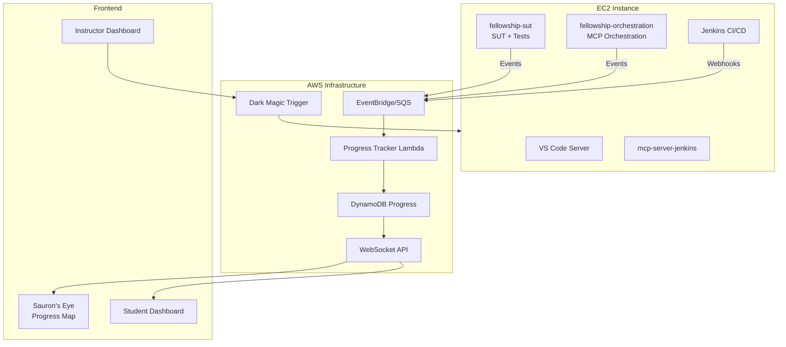
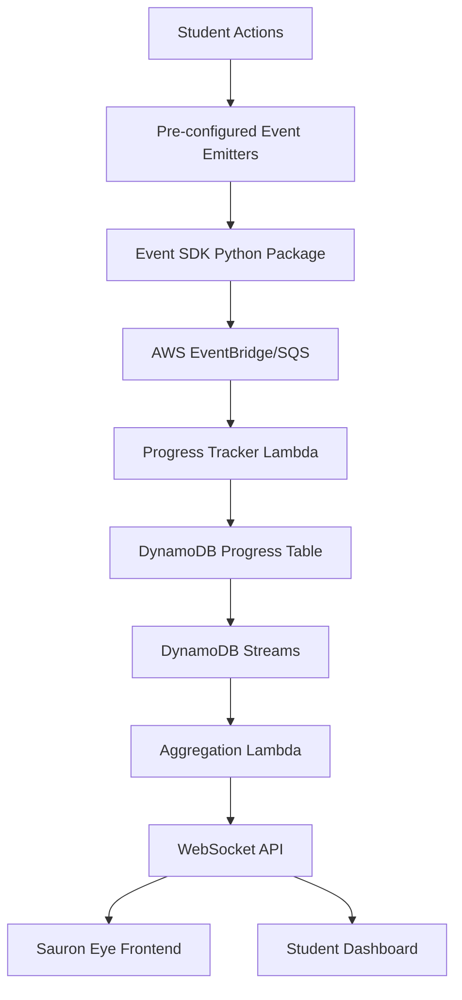

# Fellowship Tutorial: Complete Guide

## Overview

The Fellowship of the Build tutorial is an AI workshop focused on MCPs (Model Context Protocol) and test automation. Teams (Frodo/Sam pairs) work together to build a comprehensive test monitoring system using AI agents, learning skills directly applicable to daily test engineering work.

### The Story

In this gamified learning experience, teams embark on a journey to deliver "the Ring" (a comprehensive test monitoring system) to Mount Doom (production-ready quality). Along the way, they'll face challenges from Sauron (infrastructure issues) and learn to use AI agents with MCPs to overcome them.

### Learning Objectives

By the end of this tutorial, participants will:
- Understand MCPs (Model Context Protocol) and how they enable AI agents to interact with tools
- Build AI agents that monitor CI/CD pipelines and generate test reports
- Use official MCP servers (Playwright, Git, Filesystem) and create custom ones (Jenkins)
- Implement agentic workflows that automate test generation, fixing, and monitoring
- Handle infrastructure challenges through automated testing
- Create comprehensive test execution reports using AI

---

## Architecture Overview



---

## Technology Stack

### Core Technologies

- **Test Framework**: Playwright with Python
- **MCP Orchestration**: Python with LangChain
- **IDE**: VS Code Server with devcontainers
- **CI/CD**: Jenkins (pre-configured)
- **Event Tracking**: AWS EventBridge/SQS → DynamoDB
- **Real-time Updates**: WebSocket API

### Official MCP Servers

We use **official MCP servers** from the [Model Context Protocol servers repository](https://github.com/modelcontextprotocol/servers) where available:

| MCP Server | Status | Package | Installation | Use Case | Tutorial Relevance |
|------------|--------|---------|--------------|----------|-------------------|
| **Playwright** | ✅ Official | `@playwright/mcp` | `npm install -g @playwright/mcp` or `npx @playwright/mcp@latest` | Test generation, browser automation | **Critical** - Primary test automation |
| **Git** | ✅ Official | `mcp-server-git` | `uvx mcp-server-git` or `pip install mcp-server-git` | Repository management, commit tracking | **High** - Track test file changes |
| **Filesystem** | ✅ Official | `@modelcontextprotocol/server-filesystem` | `npx -y @modelcontextprotocol/server-filesystem` | File operations, test file management | **Medium** - Read/write test files |
| **GitHub** | ✅ Official | `@modelcontextprotocol/server-github` | `npx -y @modelcontextprotocol/server-github` | GitHub integration, CI/CD workflows | **Low** - Optional, if using GitHub Actions |
| **Postgres** | ✅ Official | `@modelcontextprotocol/server-postgres` | `npx -y @modelcontextprotocol/server-postgres` | Database operations | **Low** - Optional, if SUT uses Postgres |
| **Jenkins** | ❌ Custom | `mcp-server-jenkins` (to create) | Custom implementation | CI/CD monitoring | **Critical** - No official available |

### Custom MCP Servers

**Jenkins MCP Server** (Custom - Required)
- **Status**: No official MCP server exists
- **Implementation**: Custom Python MCP server wrapping Jenkins REST API
- **Location**: Separate repository `mcp-server-jenkins`
- **Installation**: `pip install mcp-server-jenkins` or `uvx mcp-server-jenkins`
- **Tools**: Get job status, trigger jobs, retrieve logs, analyze failures
- **Repository**: `https://github.com/testingfantasy/mcp-server-jenkins`
- **See**: [JENKINS_MCP_ANALYSIS.md](JENKINS_MCP_ANALYSIS.md) for detailed analysis and options

**MailHog MCP Server** (Custom - Optional)
- **Status**: No official MCP server exists
- **Implementation**: Custom using MailHog API (optional, can use web UI)
- **Relevance**: Low priority

### Repository Structure

**Four Repositories:**

1. **`mcp-server-jenkins`** - Jenkins MCP Server (Separate Public Repository)
   - Standalone MCP server for Jenkins CI/CD
   - 7 MCP tools (get_jenkins_status, trigger_jenkins_job, etc.)
   - Published to PyPI: `pip install mcp-server-jenkins`
   - Can be published to official MCP registry
   - Location: `https://github.com/testingfantasy/mcp-server-jenkins`

2. **`fellowship-orchestration`** - MCP Orchestration (Separate Public Repository)
   - LangChain/LangGraph orchestration workflows
   - Agent templates (MonitoringAgent, TestAgent)
   - Orchestrator implementation
   - Example workflows and configurations
   - Dependencies: `mcp-server-jenkins`, `fellowship-events`, official MCPs
   - Location: `https://github.com/testingfantasy/fellowship-orchestration`

3. **`fellowship-events`** - Event Tracking SDK (Separate Public Repository)
   - Event client implementation
   - AWS EventBridge/SQS integration
   - Batching and retry logic
   - Published to PyPI: `pip install fellowship-events`
   - Used by all repositories
   - Location: `https://github.com/testingfantasy/fellowship-events`

4. **`fellowship-sut`** - SUT + Playwright Tests (Workshop Directory)
   - System Under Test web application (Docker Compose)
   - Playwright test suite (`tests/`)
   - Page Object Model (`playwright/page_objects/`)
   - Pytest configuration with event tracking hooks
   - Sample test cases (some intentionally failing)
   - Tutorial-specific, bundled with EC2 setup
   - Location: `iac/aws/workshops/fellowship/fellowship-sut/`

---

## Terminology Glossary

### MCP (Model Context Protocol)
A standard protocol that allows AI agents to interact with tools and services. Think of it as a "bridge" between AI and your existing tools (Jenkins, Playwright, etc.).

- **Official MCPs**: Pre-built MCP servers from the community (e.g., `@playwright/mcp`, `mcp-server-git`)
- **Custom MCPs**: Created by teams for specific needs (e.g., Jenkins MCP for this tutorial)

### MCP Server
A service that exposes tools/resources via the MCP protocol.

- **Examples**: Jenkins MCP server (exposes Jenkins API), Playwright MCP server (exposes test management)
- **Official**: Provided by tool maintainers (e.g., `@playwright/mcp`)
- **Custom**: Created by teams for specific needs

### MCP Client
A client that connects to MCP servers (usually the AI agent).

- **Example**: LangChain agent is an MCP client

### AI Agent
An AI-powered assistant (using LangChain + LLM) that can use MCP tools. Makes decisions and takes actions based on goals.

- **Examples**: "Monitoring Agent" (watches Jenkins), "Test Agent" (generates/fixes tests)

### Agentic Workflow
A workflow where an AI agent orchestrates multiple steps automatically. The agent makes decisions and takes actions based on the situation.

- **Example**: Agent monitors Jenkins → detects failure → analyzes logs → generates test → fixes issue

### Orchestration
Coordinating multiple agents and MCP servers to achieve a goal.

- **Example**: Orchestrator coordinates Monitoring Agent + Test Agent + Jenkins MCP + Playwright MCP

### Orchestrator
The component that coordinates multiple agents.

- **Example**: `Orchestrator` class that manages Monitoring Agent + Test Agent

---

## Choose Your Tutorial Path

The Fellowship tutorial can be completed in two different timeframes, depending on your available time and learning goals.

### ⚡ Short Tutorial (1.5 hours) - "The Quick Journey"

**Perfect for**: Quick introduction to MCPs and basic monitoring

**What you'll learn:**
- Set up environment and access EC2 instance
- Run Playwright tests
- Check Jenkins pipeline
- Create basic monitoring agent
- Generate simple report

**Core Steps**: 1-6, 7-10, 12-14, 27 (14 steps total)

**Time Breakdown:**
- Setup & Testing: 35 minutes
- MCP Basics: 25 minutes
- Monitoring Agent: 30 minutes
- Simple Report: 10 minutes

**Skip These in Short Tutorial:**
- 🔧 Test generation with Playwright MCP (Extended)
- 🔧 Test fixing with agents (Extended)
- 🔧 Multi-agent orchestration (Extended)
- 🔧 Dark magic challenges (Extended)
- 🔧 Advanced monitoring (Extended)
- 🔧 Comprehensive reporting (Extended)

### 🎯 Full Tutorial (3-4 hours) - "The Complete Quest"

**Perfect for**: Complete MCP orchestration experience

**What you'll learn:**
- Everything in Short Tutorial PLUS
- Test generation with AI agents
- Test fixing with Playwright MCP
- Multi-agent orchestration
- Dark magic challenge detection and resolution
- Comprehensive reporting and submission

**All Steps**: 1-32 (Core + Extended)

**Time Breakdown:**
- Setup & Testing: 35 minutes
- MCP Basics: 25 minutes
- Monitoring Agent: 30 minutes
- Test Automation (Extended): 60-90 minutes
- Advanced Orchestration (Extended): 45-60 minutes
- Dark Magic Challenges (Extended): 60-90 minutes
- Advanced Monitoring (Extended): 45-60 minutes
- Final Delivery (Extended): 30-45 minutes

**Path Indicators:**
- ⭐ **Core** - Required for both Short and Full tutorials
- 🔧 **Extended** - Only in Full Tutorial (3-4 hours)
- 💡 **Optional** - Can be skipped in either path

---

## Student Workflow: 32 Steps to Mount Doom

### Phase 1: Environment Setup & Discovery (30-45 minutes)

**Short Tutorial**: Steps 1-4 (15 minutes)  
**Full Tutorial**: Steps 1-4 (15 minutes)

#### Step 1: Access Tutorial Documentation ⭐ Core (5 min)
- **Action**: Scan QR code or visit Docusaurus webpage
- **Location**: `fellowship-of-the-build.testingfantasy.com`
- **What to do**:
  1. Read tutorial overview
  2. Understand the Fellowship story (deliver the Ring to Mount Doom)
  3. Review learning objectives
  4. **Choose your path**: Short (1.5h) or Full (3-4h)
- **Expected Event**: `team.registered` (automatic)

#### Step 2: Get Team Credentials & Environment ⭐ Core (5 min)
- **Action**: Access team-specific page in Docusaurus
- **What you'll get**:
  - Team ID (e.g., `frodo-sam-01`)
  - EC2 instance IP address
  - VS Code Server URL and password
  - API keys for AI services (OpenAI/Claude)
  - Jenkins credentials
  - Repository URLs
- **Expected Event**: `environment.accessed` (automatic on first connection)

#### Step 3: Access Your EC2 Environment ⭐ Core (5 min)
- **Action**: Connect to VS Code Server
- **URL**: `http://<EC2-IP>:8080`
- **What you'll find**:
  - VS Code Server with pre-installed extensions
  - Repositories cloned and packages installed:
    - `fellowship-sut` (SUT + Playwright tests, in workshop directory)
    - `fellowship-orchestration` (MCP orchestration, cloned from GitHub)
    - `mcp-server-jenkins` (installed via pip) - *MVP: May use direct Jenkins API instead*
    - `fellowship-events` (installed via pip) - *MVP: May not be installed yet*
  - Jenkins running at `http://<EC2-IP>:8080/jenkins`
  - SUT (System Under Test) at `http://<EC2-IP>:3000`
  - MailHog (email testing) at `http://<EC2-IP>:8025`
- **Expected Event**: `repository.cloned` (automatic) - *MVP: May be manual*

#### Step 4: Explore the SUT and Test Repository ⭐ Core (5 min)
- **Action**: Open `fellowship-sut` repository in VS Code
- **What to explore**:
  - `tests/` directory - Sample test cases (some intentionally failing)
  - `playwright/page_objects/` - Page Object Model examples
  - `conftest.py` - Pytest configuration (*MVP: May not have event tracking yet*)
  - SUT web application (Docker Compose setup)
  - `README.md` - Repository documentation
- **Learning Goal**: Understand test structure, Page Object Model, and SUT

#### Step 5: Run Sample Tests ⭐ Core (10 min)
- **Action**: Execute the pre-configured test suite
- **Command**: `cd fellowship-sut && pytest tests/ -v`
- **What to observe**:
  - Some tests pass, some fail (intentional)
  - Test execution is automatically tracked (*MVP: May be manual tracking*)
  - Check your progress on the student dashboard (*MVP: May not be available yet*)
- **Expected Events**: 
  - `test.suite.executed` (automatic) - *MVP: May be manual*
  - `test.result.passed` / `test.result.failed` (automatic) - *MVP: May be manual*
  - `milestone.first_test` (automatic) - *MVP: May be manual*

#### Step 6: Check Jenkins Pipeline ⭐ Core (10 min)
- **Action**: Access Jenkins and trigger a test pipeline
- **URL**: `http://<EC2-IP>:8080/jenkins`
- **What to do**:
  1. Log in with provided credentials
  2. Find the "Fellowship Test Pipeline" job
  3. Trigger a build manually
  4. Watch the pipeline execute
  5. Review test results in Jenkins
- **Expected Events**:
  - `jenkins.job.triggered` (automatic via webhook) - *MVP: May be manual*
  - `jenkins.job.completed` or `jenkins.job.failed` (automatic) - *MVP: May be manual*

---

### Phase 2: MCP Integration & Understanding (25 minutes)

**Short Tutorial**: Steps 7-10 (25 minutes)  
**Full Tutorial**: Steps 7-10 (25 minutes)

#### Step 7: Explore MCP Orchestration Repository ⭐ Core (5 min)
- **Action**: Open `fellowship-orchestration` repository
- **What to explore**:
  - `src/agents/` - AI agent templates (MonitoringAgent, TestAgent)
  - `src/orchestrator.py` - Main orchestrator
  - `src/config/` - MCP configuration files (*MVP: May not exist yet*)
  - `README.md` - MCP setup instructions
- **Learning Goal**: Understand MCP architecture and agent structure
- **Note**: Jenkins MCP is installed separately via `pip install mcp-server-jenkins` - *MVP: May use direct Jenkins API instead*

#### Step 8: Install MCP Servers and Packages ⭐ Core (10 min)
- **Action**: Install required MCP servers and packages
- **Commands** (MVP: Simplified):
  ```bash
  # MVP: May skip these initially, use direct APIs
  # pip install fellowship-events  # Phase 2
  # pip install mcp-server-jenkins  # Phase 3
  
  # For Full Tutorial (Phase 3+):
  # Install event tracking SDK (PyPI)
  pip install fellowship-events
  
  # Install Jenkins MCP server (PyPI or from repo)
  pip install mcp-server-jenkins
  
  # Install official Playwright MCP (Extended features)
  npm install -g @playwright/mcp
  
  # Install official Git MCP (Extended features)
  uvx mcp-server-git
  ```
- **What you're doing**: Setting up MCP servers and dependencies that AI agents will use
- **MVP Note**: For MVP, you may use direct Jenkins API instead of MCP
- **Expected Event**: `mcp.server.installed` (automatic) - *MVP: May be manual*

#### Step 9: Configure MCP Servers ⭐ Core (5 min)
- **Action**: Configure MCP servers with credentials
- **Files to edit**:
  - `.env` - Add API keys and credentials
  - `src/config.py` - Configure MCP server connections (*MVP: May use direct API config*)
- **What to configure**:
  - Jenkins URL and credentials (*MVP: Direct API, not MCP*)
  - AI service API keys (OpenAI/Claude)
  - Playwright test repository path (*Extended: For test generation*)
  - Git repository path (*Extended: For Git MCP*)
- **Learning Goal**: Understand MCP server configuration
- **MVP Note**: For MVP, configure direct Jenkins API access instead of MCP

#### Step 10: Test MCP Server Connection ⭐ Core (5 min)
- **Action**: Verify MCP servers are working
- **Command**: `python src/test_mcp_connection.py` (*MVP: May test direct API instead*)
- **What to verify**:
  - Jenkins connection works (*MVP: Direct API, not MCP*)
  - Playwright MCP can access test repository (*Extended*)
  - Git MCP can access repository (*Extended*)
  - All servers respond correctly
- **Expected Event**: `mcp.server.connected` (automatic) - *MVP: May be manual*

---

### Phase 3: Building Your First Agentic Workflow (30 minutes)

**Short Tutorial**: Steps 11-14 (30 minutes)  
**Full Tutorial**: Steps 11-14 (30 minutes)

#### Step 11: Understand Agentic Workflows ⭐ Core (5 min)
- **Action**: Read about agentic workflows in Docusaurus
- **Key Concepts**:
  - **Agent**: AI assistant that uses MCP tools (*MVP: May use direct APIs*)
  - **Workflow**: Sequence of actions the agent performs
  - **Orchestration**: Coordinating multiple agents (*Extended*)
- **Example Workflow**:
  1. Jenkins pipeline fails
  2. Monitoring Agent detects failure
  3. Agent uses Jenkins API/MCP to get logs (*MVP: Direct API*)
  4. Agent uses Playwright MCP to analyze test (*Extended*)
  5. Agent fixes the test (*Extended*)
  6. Agent triggers new pipeline

#### Step 12: Create Your First Monitoring Agent ⭐ Core (10 min)
- **Action**: Set up a basic monitoring agent
- **File**: `src/agents/monitoring_agent.py` (template provided)
- **What to do**:
  1. Review the template code
  2. Configure the agent to use Jenkins (*MVP: Direct API, not MCP*)
  3. Set up the agent to watch Jenkins pipelines
  4. Configure what the agent should do when it detects issues
- **Code Example** (MVP: Direct API):
  ```python
  from agents.monitoring_agent import MonitoringAgent
  import requests  # MVP: Direct API instead of MCP
  
  # MVP: Direct Jenkins API
  jenkins_url = "http://localhost:8080/jenkins"
  jenkins_auth = ("user", "token")
  
  # Create monitoring agent
  agent = MonitoringAgent(jenkins_url, jenkins_auth)
  
  # Start monitoring
  await agent.start_monitoring()
  ```
- **Code Example** (Full: With MCP):
  ```python
  from agents.monitoring_agent import MonitoringAgent
  from mcp_server_jenkins import JenkinsMCPServer
  
  # Initialize MCP server
  jenkins_mcp = JenkinsMCPServer()
  
  # Create monitoring agent
  agent = MonitoringAgent(jenkins_mcp)
  
  # Start monitoring
  await agent.start_monitoring()
  ```
- **Expected Event**: `mcp.agent.created` (automatic) - *MVP: May be manual*

#### Step 13: Configure Pipeline-Triggered Workflow ⭐ Core (10 min)
- **Action**: Set up workflow to trigger on Jenkins pipeline execution
- **What to configure**:
  - **MVP**: Polling mechanism that checks Jenkins periodically
  - **Full**: Jenkins webhook → API Gateway → Lambda → Agent (*Phase 2*)
- **Learning Goal**: Understand event-driven agentic workflows
- **Real-world application**: Automatically respond to CI/CD failures

#### Step 14: Test Your Monitoring Agent ⭐ Core (10 min)
- **Action**: Trigger a Jenkins pipeline and watch the agent respond
- **What to observe**:
  - Agent detects pipeline execution
  - Agent retrieves pipeline status
  - Agent analyzes results
  - Check agent logs for its decision-making process
- **Expected Events**:
  - `jenkins.monitored` (automatic) - *MVP: May be manual*
  - `mcp.tool.invoked` (for each MCP tool call) - *MVP: Not applicable (using direct API)*

---

### Phase 4: Test Automation with MCPs (60-90 minutes) 🔧 Extended

**Short Tutorial**: Skip this phase  
**Full Tutorial**: Steps 15-17 (60-90 minutes)

#### Step 15: Use Official Playwright MCP to Generate Tests 🔧 Extended (20-30 min)
- **Action**: Use official Playwright MCP to generate a test case
- **Method 1: Via Test Agent** (Recommended)
  ```python
  from agents.test_agent import TestAgent
  
  test_agent = TestAgent()
  result = await test_agent.generate_test(
      requirement="Test that user can login with valid credentials",
      test_file="tests/test_login_generated.py"
  )
  ```
- **Method 2: Direct Official MCP Usage**
  ```python
  # Use official @playwright/mcp
  # Configured in MCP client settings
  # Agent automatically uses Playwright MCP tools
  ```
- **What happens**:
  - AI analyzes the requirement using official Playwright MCP
  - AI generates Playwright test code
  - Test file is created automatically
- **Expected Events**:
  - `mcp.tool.invoked` with `tool: 'generate_test_from_requirement'`
  - `test.case.created` with `method: 'mcp'`

#### Step 16: Fix Failing Tests Using Playwright MCP 🔧 Extended (20-30 min)
- **Action**: Use Playwright MCP to fix a failing test
- **Steps**:
  1. Identify a failing test (from Step 5)
  2. Use Test Agent to analyze and fix it:
     ```python
     result = await test_agent.fix_failing_test(
         test_file="tests/test_login.py",
         error_message="Element not found: #username"
     )
     ```
  3. Verify the fix works
  4. Commit the fixed test
- **Expected Events**:
  - `mcp.tool.invoked` with `tool: 'fix_playwright_test'`
  - `test.case.fixed` with `method: 'mcp'`

#### Step 17: Execute Tests and Verify 🔧 Extended (20-30 min)
- **Action**: Run the generated/fixed tests
- **Command**: `pytest tests/test_*_generated.py -v`
- **What to verify**:
  - Generated tests execute correctly
  - Fixed tests now pass
  - All tests are tracked automatically
- **Learning Goal**: Understand AI-assisted test maintenance

---

### Phase 5: Advanced Orchestration (45-60 minutes) 🔧 Extended

**Short Tutorial**: Skip this phase  
**Full Tutorial**: Steps 18-20 (45-60 minutes)

#### Step 18: Build Test Agent 🔧 Extended (15-20 min)
- **Action**: Create a Test Agent that uses Playwright MCP
- **File**: `src/agents/test_agent.py` (template provided)
- **What to configure**:
  - Agent uses official Playwright MCP tools
  - Agent can generate, fix, and analyze tests
  - Agent responds to test failures automatically
- **Code Example**:
  ```python
  from agents.test_agent import TestAgent
  # Official Playwright MCP is configured in MCP client
  # Agent automatically has access to Playwright MCP tools
  
  test_agent = TestAgent()
  
  # Agent can now generate and fix tests using official MCP
  await test_agent.generate_test(...)
  await test_agent.fix_failing_test(...)
  ```

#### Step 19: Create Orchestrator 🔧 Extended (15-20 min)
- **Action**: Build an orchestrator that coordinates multiple agents
- **File**: `src/orchestrator.py` (template provided)
- **What to build**:
  - Orchestrator coordinates Monitoring Agent + Test Agent
  - When Monitoring Agent detects failure → Orchestrator triggers Test Agent
  - Orchestrator manages agent lifecycle
- **Code Example**:
  ```python
  from orchestrator import Orchestrator
  from agents.monitoring_agent import MonitoringAgent
  from agents.test_agent import TestAgent
  
  orchestrator = Orchestrator()
  orchestrator.add_agent(MonitoringAgent(...))
  orchestrator.add_agent(TestAgent(...))
  
  # Start orchestrated workflow
  await orchestrator.start()
  ```

#### Step 20: Integrate Agents with Jenkins Pipeline 🔧 Extended (15-20 min)
- **Action**: Configure agents to respond to Jenkins pipeline events
- **What to configure**:
  - Jenkins webhook → Triggers orchestrator
  - Orchestrator → Coordinates agents
  - Agents → Use MCPs (official Playwright + custom Jenkins) to take actions
- **Workflow**:
  1. Pipeline fails
  2. Webhook triggers orchestrator
  3. Orchestrator activates Monitoring Agent
  4. Monitoring Agent uses Jenkins MCP to analyze failure
  5. Orchestrator activates Test Agent
  6. Test Agent uses Playwright MCP to fix the test
  7. Orchestrator triggers new pipeline
- **Learning Goal**: Understand end-to-end agentic workflows

---

### Phase 6: Dark Magic Challenges (60-90 minutes) 🔧 Extended

**Short Tutorial**: Skip this phase  
**Full Tutorial**: Steps 21-24 (60-90 minutes)

#### Step 21: First Dark Magic Attack 🔧 Extended (15-20 min)
- **Action**: Sauron's first attack occurs (instructor-triggered)
- **What happens**: Infrastructure issue appears (e.g., database connection fails)
- **What to do**:
  1. Detect the issue (tests start failing)
  2. Investigate using your monitoring tools
  3. Identify it's a "dark magic" challenge (not a normal test failure)
  4. Document the issue
- **Expected Event**: `dark_magic.detected` (manual or automatic)

#### Step 22: Generate Test for Dark Magic 🔧 Extended (15-20 min)
- **Action**: Create a test that detects the dark magic issue
- **Method**: Use Playwright MCP or Test Agent
  ```python
  # Generate test that detects database connection issue
  await test_agent.generate_test(
      requirement="Test that detects database connection failures",
      test_file="tests/test_dark_magic_db.py"
  )
  ```
- **Expected Events**:
  - `dark_magic.test.created` (automatic)
  - `test.case.created` (automatic)

#### Step 23: Resolve Dark Magic Challenge 🔧 Extended (15-20 min)
- **Action**: Fix the infrastructure issue
- **What to do**:
  1. Analyze the root cause
  2. Fix the issue (restore database connection, restart service, etc.)
  3. Verify the fix works
  4. Document the resolution
- **Expected Event**: `dark_magic.resolved` (manual or automatic)

#### Step 24: Additional Dark Magic Challenges 🔧 Extended (15-30 min)
- **Action**: More challenges appear throughout the tutorial
- **Types of challenges**:
  - Database connection lost
  - Jenkins service stopped
  - API secrets rotated
  - Network latency injected
  - Test file corruption
  - Resource exhaustion
- **What to do for each**:
  1. Detect the issue
  2. Generate test to verify the issue
  3. Resolve the issue
  4. Document in your report

---

### Phase 7: Monitoring & Reporting (45-60 minutes)

**Short Tutorial**: Step 27 only (10 min)  
**Full Tutorial**: Steps 25-29 (45-60 minutes)

#### Step 25: Configure Jenkins Monitoring Agent 🔧 Extended (15-20 min)
- **Action**: Set up agent to monitor Jenkins logs and pipelines
- **What to configure**:
  - Agent watches Jenkins job executions (using Jenkins MCP)
  - Agent analyzes build logs
  - Agent detects patterns (failures, slow builds, etc.)
  - Agent generates alerts/reports
- **Code Example**:
  ```python
  monitoring_agent = MonitoringAgent(jenkins_mcp)
  
  # Configure what to monitor
  monitoring_agent.watch_jobs(["test-suite", "integration-tests"])
  monitoring_agent.analyze_logs = True
  monitoring_agent.generate_reports = True
  
  # Start monitoring
  await monitoring_agent.start()
  ```

#### Step 26: Configure Test Results Monitoring 🔧 Extended (15-20 min)
- **Action**: Set up agent to monitor test execution results
- **What to configure**:
  - Agent analyzes test results from Jenkins
  - Agent identifies flaky tests
  - Agent tracks test trends
  - Agent generates test reports
- **Learning Goal**: Understand test analytics and monitoring

#### Step 27: Generate First Comprehensive Report ⭐ Core (10 min)
- **Action**: Use agents to generate a test execution report
- **What the report should include**:
  - Executive summary
  - Test execution overview
  - Failed tests analysis
  - Dark magic challenges detected/resolved
  - Recommendations
- **Method**: Use orchestrator to coordinate report generation
  ```python
  report = await orchestrator.generate_report(
      include_test_results=True,
      include_dark_magic=True,
      include_recommendations=True
  )
  ```
- **Expected Event**: `milestone.report_generated` (automatic)

#### Step 28: Send Report via Email 🔧 Extended (15-20 min)
- **Action**: Configure agent to send reports via email
- **What to configure**:
  - Use MailHog for email testing (pre-configured)
  - Configure email template
  - Set up automatic sending on pipeline completion
- **Method**: Use orchestrator capability
  ```python
  await orchestrator.send_report(
      report=report,
      recipients=["fellowship-submissions@testingfantasy.com"],
      method="email"
  )
  ```

#### Step 29: Continuous Reporting 🔧 Extended (15-20 min)
- **Action**: Set up continuous reporting workflow
- **What happens**:
  - Every pipeline execution → Agent generates report
  - Report is sent automatically
  - Reports accumulate points for your team
- **Workflow**:
  1. Pipeline completes
  2. Monitoring Agent analyzes results (using Jenkins MCP)
  3. Test Agent analyzes test failures (using Playwright MCP)
  4. Orchestrator generates report
  5. Report is sent via email
  6. Points are awarded
- **Expected Events**: 
  - `report.generated` (automatic)
  - Points calculated and updated

---

### Phase 8: Final Delivery (30-45 minutes) 🔧 Extended

**Short Tutorial**: Skip this phase (Step 27 is sufficient)  
**Full Tutorial**: Steps 30-32 (30-45 minutes)

#### Step 30: Generate Final Comprehensive Report 🔧 Extended (15-20 min)
- **Action**: Create final report summarizing entire journey
- **Report Requirements**:
  1. Executive Summary
  2. Test Suite Overview (total tests, pass/fail rates)
  3. MCP Integration Summary (which MCPs used, how)
  4. Dark Magic Challenges Detected (list all)
  5. Dark Magic Challenges Resolved (list all)
  6. Test Cases Generated (count, examples)
  7. Test Cases Fixed (count, examples)
  8. Monitoring Agent Capabilities (what it monitors)
  9. Recommendations (AI-generated insights)
  10. Appendix (code snippets, configurations)
- **Method**: Use orchestrator to generate comprehensive report
  ```python
  final_report = await orchestrator.generate_final_report(
      include_all_sections=True,
      include_code_examples=True,
      include_recommendations=True
  )
  ```

#### Step 31: Submit Final Report 🔧 Extended (10-15 min)
- **Action**: Submit report via API or email
- **Method 1: API** (Recommended)
  ```bash
  curl -X POST https://api.fellowship.testingfantasy.com/api/teams/{team_id}/submit \
    -H "Content-Type: application/json" \
    -d @final_report.json
  ```
- **Method 2: Email**
  - Send to: `fellowship-submissions@testingfantasy.com`
  - Subject: `Fellowship Final Report - {team_id}`
  - Attach: `final_report.md` or `final_report.html`
- **Expected Event**: `milestone.final_submission` (automatic)

#### Step 32: Verify Submission 🔧 Extended (5-10 min)
- **Action**: Check that your report was received
- **What to check**:
  - Confirmation email/message
  - Report appears in your dashboard
  - Points are calculated
  - Your team appears in leaderboard

---

## Progress Tracking

Progress tracking is **completely automated** and **pre-configured**. Attendees don't need to manually track their progress - everything happens automatically through:

1. **Pre-configured event emitters** in the codebase
2. **Git hooks** that detect code changes
3. **Pytest hooks** that track test execution
4. **MCP server hooks** that track MCP interactions
5. **Jenkins webhooks** that track CI/CD pipeline runs
6. **CLI wrappers** for common operations

### How It Works: Step-by-Step

#### Step 1: Team Registration
When a team registers and gets their environment:
1. **Team credentials are generated** (team_id, API keys, etc.)
2. **Credentials are stored** in AWS Secrets Manager
3. **Environment variables are set** on EC2 instance with team credentials
4. **Event is automatically emitted**: `team.registered`
   - Emitted by: Registration Lambda function
   - Contains: `team_id`, `frodo_name`, `sam_name`, `timestamp`

#### Step 2: Repository Access
When teams first access their repositories:
1. **Repositories are pre-cloned** on EC2 instance with team credentials embedded
2. **Git hooks are installed** automatically during clone
3. **Event SDK is pre-configured** with team credentials from environment variables
4. **Event is automatically emitted**: `repository.cloned`
   - Emitted by: Git post-merge hook
   - Contains: `team_id`, `repository_name`, `timestamp`

#### Step 3: Test Execution
When teams run tests:
1. **Pytest executes** with pre-configured hooks
2. **Pytest hooks automatically emit events**:
   - `test.case.started` - When each test starts
   - `test.result.passed` / `test.result.failed` - When each test completes
   - `test.suite.executed` - When entire test suite completes
3. **No manual code required** - hooks are in `conftest.py`

**Example Flow:**
```python
# Team runs: pytest tests/test_login.py

# Automatically emits:
# 1. test.case.started { test_name: "test_valid_login" }
# 2. test.result.passed { test_name: "test_valid_login", duration: 1.2 }
# 3. test.case.started { test_name: "test_invalid_login" }
# 4. test.result.failed { test_name: "test_invalid_login", error: "..." }
# 5. test.suite.executed { total: 2, passed: 1, failed: 1 }
```

#### Step 4: Test Creation/Modification
When teams create or modify test files:
1. **Git detects file changes** (via git hooks)
2. **Git hook analyzes changes**:
   - New test file → `test.case.created`
   - Modified test file after failure → `test.case.fixed`
3. **Event is automatically emitted`

#### Step 5: MCP Integration
When teams work with MCPs:
1. **MCP servers have pre-configured event hooks**
2. **When MCP tool is invoked**, event is automatically emitted:
   - `mcp.tool.invoked` - When any MCP tool is called
   - `mcp.server.connected` - When MCP server connects to agent
   - `mcp.agent.created` - When monitoring agent is created

**Example Flow:**
```python
# Team uses MCP tool in their agent code
from mcp_servers.jenkins_mcp import JenkinsMCPServer

server = JenkinsMCPServer()
status = await server.get_jenkins_status("test-job")

# Automatically emits:
# mcp.tool.invoked { tool: "get_jenkins_status", parameters: {...} }
```

#### Step 6: Jenkins Pipeline Execution
When Jenkins runs tests:
1. **Jenkins is pre-configured** with webhook to API Gateway
2. **Webhook triggers Lambda** on job start/complete/fail
3. **Lambda automatically emits events**:
   - `jenkins.job.triggered` - When pipeline starts
   - `jenkins.job.completed` - When pipeline succeeds
   - `jenkins.job.failed` - When pipeline fails

### Event Flow Architecture



### Event SDK: How It Works

The event SDK is **pre-installed** in both repositories:

```bash
# Install from PyPI (all repositories use this)
pip install fellowship-events

# Or add to requirements.txt in each repository:
# fellowship-events==1.0.0
```

**Configuration:**
The SDK reads configuration from environment variables (pre-set on EC2):

```bash
# Set automatically during EC2 setup
export FELLOWSHIP_TEAM_ID="frodo-sam-01"
export FELLOWSHIP_WORKSHOP="fellowship"
export FELLOWSHIP_EVENT_BUS="arn:aws:events:..."
export FELLOWSHIP_REGION="eu-west-1"
```

**Usage (Automatic):**
Teams **don't need to use the SDK directly** - it's integrated everywhere:

**In Pytest (automatic):**
```python
# fellowship-sut/tests/conftest.py (pre-configured)
from fellowship_events import EventClient

@pytest.hookimpl(tryfirst=True)
def pytest_runtest_logreport(report):
    client = EventClient()  # Reads team_id from env
    if report.when == 'call':
        event_type = 'test.result.passed' if report.passed else 'test.result.failed'
        client.emit(event_type, {
            'test_name': report.nodeid,
            'duration': report.duration
        })
```

**In MCP Servers (automatic):**
```python
# mcp-server-jenkins (installed via pip)
from fellowship_events import EventClient

class JenkinsMCPServer:
    def __init__(self):
        self.event_client = EventClient()  # Reads team_id from env
    
    async def get_jenkins_status(self, job_name: str):
        self.event_client.emit('mcp.tool.invoked', {
            'tool': 'get_jenkins_status',
            'parameters': {'job_name': job_name}
        })
        # ... actual implementation
```

### Event Categories

1. **Environment Events** (Auto-emitted on setup)
   - `team.registered` - When team gets environment credentials
   - `environment.accessed` - First SSH/VS Code connection
   - `repository.cloned` - When repos are cloned

2. **MCP Events** (Pre-configured in MCP orchestration repo)
   - `mcp.server.installed` - MCP server package installed
   - `mcp.server.connected` - MCP server connected to agent
   - `mcp.tool.invoked` - MCP tool called (e.g., get_jenkins_status)
   - `mcp.agent.created` - Monitoring agent created

3. **Test Events** (Pre-configured in Playwright repo)
   - `test.suite.executed` - Test suite run (via pytest hooks)
   - `test.case.created` - New test file created (via git hooks)
   - `test.case.fixed` - Test file modified after failure (via git hooks)
   - `test.result.passed` - Individual test passed
   - `test.result.failed` - Individual test failed

4. **Jenkins Events** (Via webhook integration)
   - `jenkins.job.triggered` - Pipeline started
   - `jenkins.job.completed` - Pipeline finished
   - `jenkins.job.failed` - Pipeline failed
   - `jenkins.monitored` - Agent detected Jenkins activity

5. **Dark Magic Events** (Auto-detected)
   - `dark_magic.detected` - Team detected infrastructure issue
   - `dark_magic.resolved` - Team fixed infrastructure issue
   - `dark_magic.test.created` - Test case created for dark magic

6. **Milestone Events** (Auto-calculated)
   - `milestone.environment_setup` - Environment ready
   - `milestone.mcp_connected` - MCP working
   - `milestone.first_test` - First test executed
   - `milestone.monitoring_active` - Monitoring agent running
   - `milestone.report_generated` - Report created

### Milestone Calculation

Milestones are **automatically calculated** by the aggregation Lambda:

**Milestone Rules:**
- `environment_setup`: When `team.registered` + `repository.cloned` events exist
- `mcp_connected`: When `mcp.server.connected` event exists
- `first_test`: When `test.suite.executed` event exists
- `monitoring_active`: When `mcp.agent.created` + `jenkins.monitored` events exist
- `report_generated`: When report is submitted

**Points Calculation:**
- Environment setup: 10 points
- MCP connection: 20 points
- First test execution: 15 points
- Test case creation: 25 points each
- Test case fix: 30 points each
- Dark magic detection: 40 points each
- Dark magic resolution: 50 points each
- Report generation: 100 points
- Final submission: 200 points

### Real-Time Updates

**Student Dashboard:**
- WebSocket connection to Progress API
- Updates every 5-10 seconds with latest progress
- Visual progress bar showing completion percentage
- Milestone checklist showing completed milestones
- Points leaderboard (anonymized team names)

**Sauron's Eye:**
- WebSocket connection to Progress API
- Updates every 2-3 seconds with all team progress
- Visual map showing team positions
- Color coding by progress level
- Leaderboard showing top teams

### Error Handling

The event system is designed to **never interfere** with the tutorial:
1. **Event emission failures are silent** - they don't break tests or code
2. **Retry logic** - events are retried if initial send fails
3. **Batching** - events are batched to reduce API calls
4. **Fallback** - if EventBridge is down, events are queued locally

---

## MCP Integration Guide

### Official MCP Servers

#### Playwright MCP (Official - Recommended)

**Installation:**
```bash
npm install -g @playwright/mcp
# or
npx @playwright/mcp@latest
```

**Configuration:**
Add to MCP client configuration (VS Code, Cursor, Claude Desktop):
```json
{
  "mcpServers": {
    "playwright": {
      "command": "npx",
      "args": ["-y", "@playwright/mcp"]
    }
  }
}
```

**Features:**
- Test generation from requirements
- Browser automation with accessibility snapshots
- Trace capture for debugging (`--save-trace`)
- Session logging (`--save-session`)
- Screenshot and PDF generation

**Documentation:** https://playwright.dev/agents

**Usage in Tutorial:**
- Teams use official Playwright MCP for test generation
- Agents automatically have access to Playwright MCP tools
- No custom implementation needed

#### Git MCP (Official)

**Installation:**
```bash
uvx mcp-server-git
# or
pip install mcp-server-git
```

**Configuration:**
```json
{
  "mcpServers": {
    "git": {
      "command": "uvx",
      "args": ["mcp-server-git", "--repository", "/path/to/repo"]
    }
  }
}
```

**Features:**
- Repository management
- Commit tracking
- File change detection
- Branch operations

**Usage in Tutorial:**
- Track test file changes
- Monitor repository activity
- Integrate with event tracking

#### Filesystem MCP (Official - Optional)

**Installation:**
```bash
npx -y @modelcontextprotocol/server-filesystem /path/to/allowed/files
```

**Configuration:**
```json
{
  "mcpServers": {
    "filesystem": {
      "command": "npx",
      "args": ["-y", "@modelcontextprotocol/server-filesystem", "/path/to/tests"]
    }
  }
}
```

**Features:**
- File read/write operations
- Directory listing
- File management

**Usage in Tutorial:**
- Read/write test files
- Manage test repository structure
- Alternative to custom test file management

### Custom MCP Servers

#### Jenkins MCP Server (Custom - Required)

**Status**: No official MCP server exists. See [JENKINS_MCP_ANALYSIS.md](JENKINS_MCP_ANALYSIS.md) for detailed analysis.

**Implementation**: Custom Python MCP server wrapping Jenkins REST API

**Location**: Separate repository `mcp-server-jenkins` (installed via pip)

**Tools Provided**:
1. `get_jenkins_job_status` - Get job status and build information
2. `trigger_jenkins_job` - Trigger a Jenkins job
3. `get_jenkins_build_logs` - Retrieve build logs
4. `get_jenkins_job_history` - Get recent build history
5. `analyze_jenkins_failure` - Analyze build failures
6. `get_jenkins_console_output` - Get console output
7. `cancel_jenkins_build` - Cancel a running build

**Implementation Example:**
```python
# mcp-server-jenkins (installed via pip)
from mcp import MCPServer, Tool
from typing import Dict
import requests
from fellowship_events import EventClient

class JenkinsMCPServer(MCPServer):
    def __init__(self, jenkins_url: str, username: str, api_token: str):
        super().__init__("jenkins-mcp")
        self.jenkins_url = jenkins_url.rstrip('/')
        self.username = username
        self.api_token = api_token
        self.event_client = EventClient()
        self._register_tools()
    
    def _register_tools(self):
        """Register all Jenkins MCP tools."""
        self.register_tool(Tool(
            name="get_jenkins_job_status",
            description="Get the current status of a Jenkins job",
            input_schema={
                "type": "object",
                "properties": {
                    "job_name": {"type": "string", "description": "Name of the Jenkins job"}
                },
                "required": ["job_name"]
            },
            handler=self._get_job_status
        ))
        # ... register other tools
    
    async def _get_job_status(self, job_name: str) -> Dict:
        """Get Jenkins job status."""
        self.event_client.emit('mcp.tool.invoked', {
            'tool': 'get_jenkins_job_status',
            'parameters': {'job_name': job_name}
        })
        
        try:
            url = f"{self.jenkins_url}/job/{job_name}/api/json"
            response = requests.get(
                url,
                auth=(self.username, self.api_token),
                timeout=10
            )
            response.raise_for_status()
            data = response.json()
            
            return {
                "status": "success",
                "job_name": job_name,
                "last_build": data.get('lastBuild', {}).get('number'),
                "last_successful_build": data.get('lastSuccessfulBuild', {}).get('number'),
                "last_failed_build": data.get('lastFailedBuild', {}).get('number'),
                "health": data.get('healthReport', [{}])[0].get('score', 100)
            }
        except Exception as e:
            return {"status": "error", "message": str(e)}
```

**Why Custom?**
- No official Jenkins MCP server exists in the [official repository](https://github.com/modelcontextprotocol/servers)
- Critical for tutorial (Jenkins is the CI/CD tool)
- Provides learning opportunity (students see MCP server creation)
- Could be published to community post-tutorial

**See**: [JENKINS_MCP_ANALYSIS.md](JENKINS_MCP_ANALYSIS.md) for complete analysis and options.

### MCP Server Integration with LangChain Agents

**Converting MCP Tools to LangChain Tools:**

```python
from langchain.tools import StructuredTool

def get_langchain_tools(mcp_server):
    """Convert MCP tools to LangChain tools."""
    langchain_tools = []
    
    for tool in mcp_server.tools:
        langchain_tool = StructuredTool.from_function(
            func=tool.handler,
            name=tool.name,
            description=tool.description,
            args_schema=tool.input_schema
        )
        langchain_tools.append(langchain_tool)
    
    return langchain_tools
```

**Using MCP Tools in Agents:**

```python
from langchain.agents import AgentExecutor, create_openai_tools_agent
from langchain_openai import ChatOpenAI

# Get MCP tools
playwright_tools = get_langchain_tools(playwright_mcp)
jenkins_tools = get_langchain_tools(jenkins_mcp)

# Combine all tools
all_tools = playwright_tools + jenkins_tools

# Create agent with MCP tools
agent = create_openai_tools_agent(
    llm=ChatOpenAI(model="gpt-4"),
    tools=all_tools,
    prompt=prompt
)
```

### Verification: How to Check Teams Are Using MCPs

**Method 1: Event Tracking (Primary Method)**

Events are automatically emitted when MCP tools are used:
- `mcp.tool.invoked` - Every MCP tool call
- `test.case.created` with `method: 'mcp'` - Tests created via MCP
- `test.case.fixed` with `method: 'mcp'` - Tests fixed via MCP
- `mcp.agent.created` - Agent created with MCP servers

**Method 2: Code Analysis**
- Check for AI-generated code patterns
- Analyze comprehensive docstrings
- Check file creation timestamps

**Method 3: Git History**
- Analyze commit messages
- Check for bulk test creation
- Identify test fix patterns

**See**: [MCP_SERVERS.md](MCP_SERVERS.md) for detailed verification methods.

---

## Implementation Tasks

For developers implementing the Fellowship tutorial infrastructure.

### Total Estimated Time: 180-220 hours

**Breakdown by Category:**
- Progress Tracking: 20-25 hours
- Repository Setup: 15-20 hours
- EC2 & VS Code Setup: 8-12 hours
- MCP Orchestration: 25-30 hours
- Playwright Tests: 9-12 hours
- SUT: 10-13 hours
- Sauron's Eye: 18-23 hours
- Dark Magic: 22-28 hours
- Report & Winner: 14-20 hours
- Testing: 30-40 hours

### Critical Path

**Must Complete First:**
1. Event SDK package (Task 3.1)
2. Progress tracking infrastructure (Task 3.5)
3. Repository structure (Tasks 4.1-4.4, 5.1-5.3)
4. EC2 setup (Task 1.1)
5. VS Code Server (Task 2.1)

**Can Be Done in Parallel:**
- MCP orchestration repository
- Playwright test repository
- SUT development
- Sauron's Eye enhancement

**Final Integration:**
- Dark magic system
- Report submission
- Winner detection
- End-to-end testing

### Key Implementation Tasks

#### Task 1: Event SDK Package
- Create `fellowship-events` Python package
- Implement event client with batching/retry
- AWS EventBridge/SQS integration
- **Estimated Time:** 6-8 hours

#### Task 2: Progress Tracking Infrastructure
- DynamoDB table for events
- Lambda functions for processing
- WebSocket API for real-time updates
- **Estimated Time:** 8-10 hours

#### Task 3: Repository Structure
- Create mcp-server-jenkins repository (public)
- Create fellowship-orchestration repository (public)
- Create fellowship-events repository (public, PyPI)
- Create fellowship-sut in workshop directory
- Pre-configure event tracking
- **Estimated Time:** 15-20 hours

#### Task 4: MCP Server Integration
- Integrate official Playwright MCP
- Integrate official Git MCP
- Create custom Jenkins MCP server
- **Estimated Time:** 8-10 hours

#### Task 5: LangChain Agent Templates
- Monitoring Agent template
- Test Agent template
- Orchestrator implementation
- **Estimated Time:** 10-12 hours

**See**: [IMPLEMENTATION_TASKS.md](IMPLEMENTATION_TASKS.md) for complete detailed task breakdown.

---

## Testing Strategy

### Pre-Tutorial Testing Phases

#### Phase 1: Unit Testing (Week 1-2)
- Test event SDK package
- Test pytest hooks integration
- Test git hooks
- Test MCP server templates
- Test LangChain agents
- **Success Criteria**: All unit tests pass, code coverage > 80%

#### Phase 2: Integration Testing (Week 3-4)
- Test event flow end-to-end
- Test progress tracking
- Test Sauron's Eye updates
- Test dark magic challenges
- Test report submission
- **Success Criteria**: Events flow correctly, progress updates in real-time

#### Phase 3: Dry Run Testing (Week 5-6)

**3.1: Single Team Dry Run**
- Deploy one EC2 instance
- One team completes full tutorial
- Monitor all systems
- Gather feedback
- **Success Criteria**: Tutorial completable in 4-6 hours, all events tracked

**3.2: Multi-Team Dry Run (5-10 teams)**
- Deploy multiple EC2 instances
- Multiple teams complete tutorial simultaneously
- Test scalability
- Test Sauron's Eye with multiple teams
- **Success Criteria**: System handles 10 teams simultaneously, no performance issues

**3.3: Full Scale Test (20-30 teams)**
- Deploy 20-30 EC2 instances
- Test at scale
- Monitor resource usage
- Test edge cases
- **Success Criteria**: System handles 30 teams, no resource exhaustion

**See**: [IMPLEMENTATION_TASKS.md](IMPLEMENTATION_TASKS.md) Section 12 for detailed testing strategy.

---

## Daily Test Engineer Relevance

### Skills Learned → Daily Work Application

| Tutorial Skill | Daily Work Application |
|---------------|------------------------|
| **MCP Integration** | Connect AI tools to your existing test infrastructure |
| **Agentic Workflows** | Automate test monitoring and maintenance |
| **Playwright MCP** | Generate and fix tests using AI |
| **Jenkins Monitoring** | Automatically respond to CI/CD failures |
| **Test Generation** | Create tests from requirements faster |
| **Test Fixing** | Auto-fix flaky tests |
| **Report Generation** | Create executive reports automatically |
| **Orchestration** | Coordinate multiple automation tools |

### Real-World Scenarios

**Scenario 1: CI/CD Pipeline Failure**
- **Daily Work**: Manually investigate, fix test, re-run pipeline
- **With MCPs**: Agent detects failure → analyzes logs → fixes test → re-runs pipeline

**Scenario 2: Test Maintenance**
- **Daily Work**: Manually update tests when UI changes
- **With MCPs**: Agent detects UI changes → updates selectors → fixes tests

**Scenario 3: Test Generation**
- **Daily Work**: Write tests manually from requirements
- **With MCPs**: Agent generates tests from requirements → you review and refine

**Scenario 4: Test Reporting**
- **Daily Work**: Manually create test execution reports
- **With MCPs**: Agent generates comprehensive reports automatically

---

## Success Criteria

### Workshop Success
- 80%+ teams complete environment setup
- 70%+ teams successfully connect MCP
- 60%+ teams generate at least one test case
- 50%+ teams detect at least one dark magic challenge
- 40%+ teams submit comprehensive report
- Average completion time: 4-6 hours
- Post-workshop survey: 4.5/5+ satisfaction

### Technical Success
- Event tracking latency < 5 seconds
- Sauron's Eye updates in real-time (< 3s delay)
- Dark magic challenges trigger reliably
- Winner detection accuracy: 100%
- Zero data loss in progress tracking

---

## Additional Resources

### Documentation Files
- **[IMPLEMENTATION_TASKS.md](IMPLEMENTATION_TASKS.md)** - Detailed task breakdown for developers
- **[MCP_SERVERS.md](MCP_SERVERS.md)** - Detailed MCP server reference and integration guide
- **[JENKINS_MCP_ANALYSIS.md](JENKINS_MCP_ANALYSIS.md)** - Jenkins MCP server analysis and options
- **[INSTRUCTOR_GUIDE.md](INSTRUCTOR_GUIDE.md)** - Instructor-specific information

### External Resources
- [Official MCP Servers Repository](https://github.com/modelcontextprotocol/servers)
- [MCP Registry](https://registry.modelcontextprotocol.io/)
- [Playwright MCP Documentation](https://playwright.dev/agents)
- [MCP Specification](https://modelcontextprotocol.io)

---

## Questions?

- Check Docusaurus documentation
- Review repository README files
- Ask instructor during tutorial
- Check student dashboard for hints

Good luck on your journey to Mount Doom! 🧙‍♂️
