# AWS Architecture

## Detailed Component Architecture

```mermaid
flowchart TB
    subgraph client["Client Access"]
        Student["👤 Student<br/>Browser"]
        Instructor["👤 Instructor<br/>Browser"]
    end

    subgraph studentCDN["Student Access - CDN & Routing"]
        StudentCF["🌐 CloudFront<br/>testus-patronus.testingfantasy.com<br/>fellowship-of-the-build.testingfantasy.com"]
        StudentACM["🔒 ACM Certificate<br/>SSL/TLS us-east-1"]
        StudentRoute53["📡 Route53<br/>DNS Management"]
    end

    subgraph instructorCDN["Instructor Access - CDN & Routing"]
        InstructorCF["🌐 CloudFront<br/>ec2-management-env.testingfantasy.com"]
        InstructorACM["🔒 ACM Certificate<br/>SSL/TLS us-east-1"]
        InstructorRoute53["📡 Route53<br/>DNS Management"]
    end

    subgraph instructorFrontend["Instructor Frontend"]
        S3["🪣 S3 Bucket<br/>React SPA<br/>ec2-manager-frontend-common-env"]
    end

    subgraph instructorAPI["Instructor API Layer"]
        APIGW["🚪 API Gateway<br/>REST API<br/>ec2-management-api-env.testingfantasy.com"]
        CF_Func["⚡ CloudFront Function<br/>URL Rewriting"]
    end

    subgraph compute["Compute Layer"]
        LambdaIM["⚡ Lambda<br/>Instance Manager<br/>lambda-instance-manager-common-env-region"]
        LambdaUser["⚡ Lambda<br/>User Management<br/>lambda-user-management-workshop-env-region<br/>Serves HTML"]
        LambdaStatus["⚡ Lambda<br/>Status Check<br/>lambda-status-workshop-env-region"]
        LambdaDifyJira["⚡ Lambda<br/>Dify Jira API<br/>lambda-dify-jira-api-workshop-env-region"]
        LambdaStop["⚡ Lambda<br/>Stop Old Instances<br/>lambda-stop-old-instances-workshop-env-region"]
        LambdaCleanup["⚡ Lambda<br/>Admin Cleanup<br/>lambda-admin-cleanup-workshop-env-region"]
        EC2["🖥️ EC2 Instances<br/>workshop-pool-i<br/>workshop-admin-i"]
        ALB["⚖️ Application Load Balancer<br/>Per-Instance HTTPS<br/>instance-id.workshop.testingfantasy.com"]
    end

    subgraph data["Data Layer"]
        DynamoAssign["💾 DynamoDB<br/>Instance Assignments<br/>dynamodb-instance-assignments-workshop-env-region"]
        DynamoSessions["💾 DynamoDB<br/>Tutorial Sessions<br/>dynamodb-tutorial-sessions-workshop-env-region"]
        SSM["🔧 SSM Parameter Store<br/>/classroom/templates/env<br/>/classroom/workshop/env/*"]
        Secrets["🔐 Secrets Manager<br/>classroom/workshop/env/instance-manager/password"]
    end

    subgraph monitoring["Monitoring & Automation"]
        CWEvents["⏰ EventBridge<br/>Scheduled Rules<br/>Stop: Every 5 min<br/>Cleanup: Daily"]
    end

    subgraph iam["Security"]
        IAMRole["🛡️ IAM Roles<br/>Least Privilege<br/>lambda-execution-role-{workshop}-{env}-{region}"]
    end

    %% Student Access Flow
    Student -->|"HTTPS"| StudentCF
    StudentCF -->|"SSL/TLS"| StudentACM
    StudentCF -->|"DNS"| StudentRoute53
    StudentCF -->|"Direct Invoke"| LambdaUser
    LambdaUser -->|"Read/Write"| DynamoAssign
    LambdaUser -->|"Get Config"| SSM
    LambdaUser -->|"Get Secrets"| Secrets
    LambdaUser -->|"Assign Instance"| EC2

    %% Instructor Access Flow
    Instructor -->|"HTTPS"| InstructorCF
    InstructorCF -->|"SSL/TLS"| InstructorACM
    InstructorCF -->|"DNS"| InstructorRoute53
    InstructorCF -->|"Static Files<br/>(/* paths)"| S3
    InstructorCF -->|"API Calls<br/>(/api/* paths)"| CF_Func
    CF_Func -->|"Rewrite"| APIGW
    APIGW -->|"Invoke"| LambdaIM
    LambdaIM -->|"Read/Write"| DynamoAssign
    LambdaIM -->|"Read/Write"| DynamoSessions
    LambdaIM -->|"Get Templates"| SSM
    LambdaIM -->|"Get Password"| Secrets
    LambdaIM -->|"Manage Instances"| EC2
    LambdaIM -->|"Enable HTTPS"| ALB

    %% Scheduled Tasks
    CWEvents -->|"Trigger"| LambdaStop
    CWEvents -->|"Trigger"| LambdaCleanup
    LambdaStop -->|"Stop Instances"| EC2
    LambdaCleanup -->|"Terminate Instances"| EC2

    %% Lambda Permissions
    LambdaIM -.->|"Assume Role"| IAMRole
    LambdaUser -.->|"Assume Role"| IAMRole
    LambdaStatus -.->|"Assume Role"| IAMRole
    LambdaDifyJira -.->|"Assume Role"| IAMRole
    LambdaStop -.->|"Assume Role"| IAMRole
    LambdaCleanup -.->|"Assume Role"| IAMRole

    %% ALB to EC2
    ALB -->|"HTTPS Traffic"| EC2
```



## Resource Naming Convention

All AWS resources follow a consistent naming pattern:

```
{aws-service-name}-{resource-type}-{workshop-name}-{environment}-{region-code}
```

**Examples:**
- Lambda Function: `lambda-instance-manager-testus-patronus-dev-euwest1`
- DynamoDB Table: `dynamodb-instance-assignments-testus-patronus-dev-euwest1`
- S3 Bucket: `s3-ec2-manager-frontend-testus-patronus-dev-euwest1`
- IAM Role: `iam-lambda-execution-role-testus-patronus-dev-euwest1`

**Naming Components:**
- `{aws-service-name}`: AWS service identifier (lambda, dynamodb, s3, iam, etc.)
- `{resource-type}`: Specific resource type (instance-manager, instance-assignments, etc.)
- `{workshop-name}`: Workshop identifier (testus-patronus, fellowship, common)
- `{environment}`: Environment name (dev, staging, prod)
- `{region-code}`: Region code without hyphens (euwest1, uswest2, etc.)
