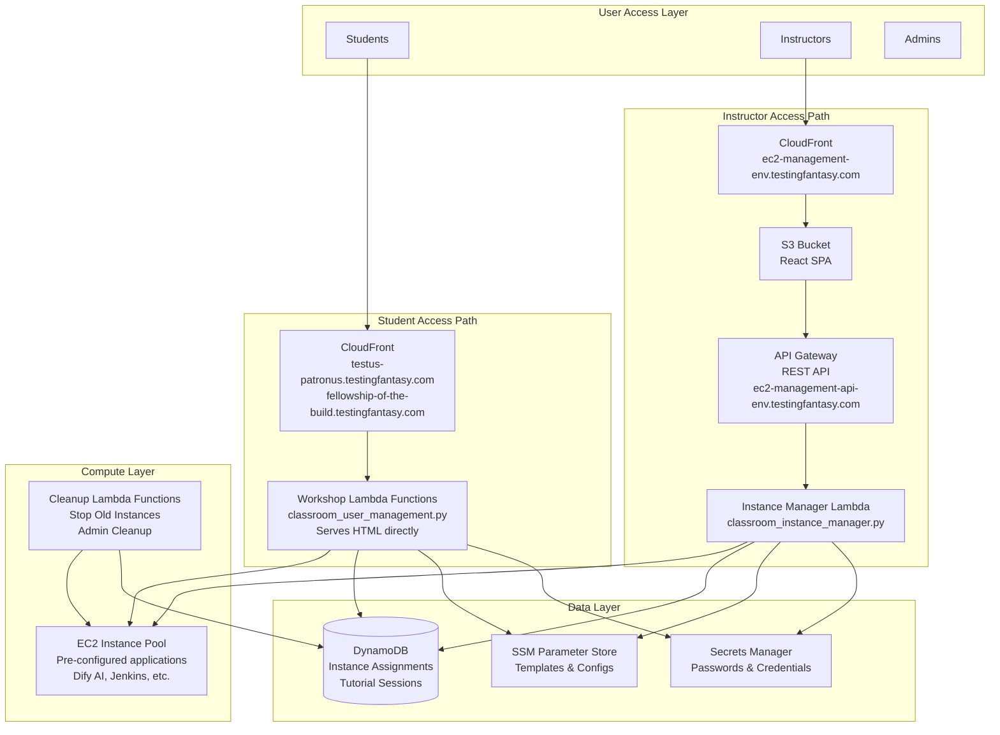

# Architecture Overview

The system follows a **serverless modular architecture** pattern with **separate access paths for students and instructors**.

## Key Components

### Student-Facing Components

1. **Workshop Lambda Functions**: Serverless functions that serve HTML pages directly to students
   - `classroom_user_management.py`: Creates student accounts and serves HTML with credentials
   - `testus_patronus_status.py`: Status checking for workshop instances
   - `dify_jira_api.py`: Dify Jira API integration
   - Accessed via CloudFront: `testus-patronus.testingfantasy.com`, `fellowship-of-the-build.testingfantasy.com`

### Instructor-Facing Components

2. **EC2 Manager Frontend (React SPA)**: Web-based management interface hosted on S3 and served via CloudFront
   - Custom domain: `ec2-management-{environment}.testingfantasy.com` (e.g., `ec2-management-dev.testingfantasy.com`)
   - Instance management, workshop configuration, tutorial session management

3. **API Gateway**: RESTful API that routes requests to Lambda functions
   - Custom domain: `ec2-management-api-{environment}.testingfantasy.com` (e.g., `ec2-management-api-dev.testingfantasy.com`)

4. **Instance Manager Lambda**: Core Lambda function handling EC2 lifecycle management
   - Manages instance creation, assignment, deletion, HTTPS setup

### Shared Components

5. **EC2 Instances**: Pre-configured compute resources for students
6. **Data Storage**: DynamoDB for state, SSM for configuration, Secrets Manager for credentials
7. **Infrastructure as Code**: Terraform modules for reproducible deployments
